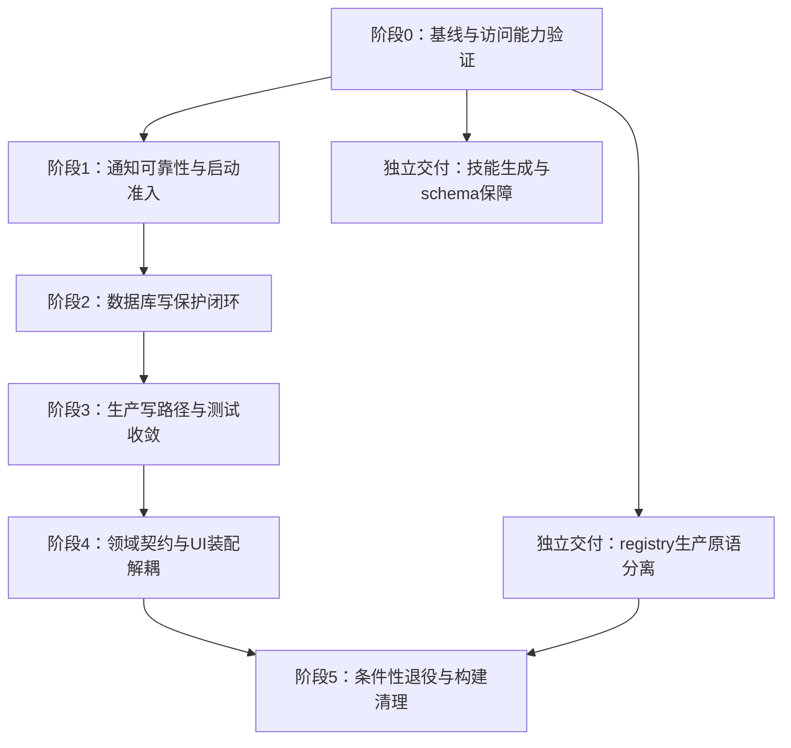

# 架构 / 解耦 / 遗留路径综合评审（代码复核修订版）

复核与实施日期：2026-09-09。范围为 `mobile/src`，并核对 `mobile/app`、原生 Android、构建配置、依赖安装元数据和相关测试。保留原 A/C 编号以便追踪；未注明前缀的代码路径相对 `mobile/src`。第一至五节保留实施前的问题证据与设计决策，旧路径/行号仅用于说明当时发现；实施后的路径、交付状态和限制以第七节为准。

总体结论：多数依赖方向、未接线入口和重复实现成立，但原评审将部分维护成本过度判为高风险，混淆了类型依赖、运行时依赖和生产调用，还存在若干错误的删除前提。已按后续授权实施通知、访问准入、事务原语和领域边界改进。数据库访问边界已有原生验证，但跨 runtime 维护互斥及在途副作用停止尚未闭环，A1 仍按“部分加固”追踪；不能由类型检查和测试推导完整产品流程已验收。

## 一、架构问题

### A1 [高，成立但须改写方案] 只读保护未覆盖数据库能力边界

**证据与纠正**

- `storage/databaseClient.ts:15` 的 getDatabase 仍返回可写 SQLite 句柄；迁移异常和 future schema 仅设置启动状态，没有写屏障。仍使用 `autodl-h3.db`，不是另开的“隔离库”。
- `storage/sqliteBusy.ts:39` 对 runAsync/getFirstAsync/getAllAsync 做 busy 重试；runAsync 是写方法，原“3 个 async 读方法”错误。`claimById` 还用 getFirstAsync 执行 `UPDATE ... RETURNING`，不能以方法名区分读写。
- 原“86 处 assert”实际是匹配行数，包含 import 和定义；本次非测试源码中为 67 次调用、2 个定义。`readOnlyWrites.test.ts` 已覆盖多个 repository 的 recovery 拒写，不能说毫无保障。
- assert 只查 recovery 表。future schema 不创建该标记；同步 getRecoveryState 将查询异常视为无恢复状态，markRecovery 写标记失败也会被吞掉。因此 UI 的 readonly 不等于数据库拒写。`app/_layout.tsx` 已隔离正常启动 UI/执行器，降低触发机会，但不能保障新入口和后台入口。

**方案**：在 storage 建立应用数据库访问能力边界，联合启动状态和运行期 recovery 状态拒绝普通写操作。先保留业务 assert，不能立即全部删除。若用 Proxy，必须覆盖 exec、prepared statement、可执行写 SQL 的查询方法及 exclusive transaction 回调的新句柄；只包 run/事务不完整。若采用连接级只读措施，须验证独立事务连接和各 JS runtime 的覆盖，不能假定主连接设置自动继承。

迁移、recovery 标记、备份恢复及用户确认后的 reset 必须有独立维护通道，普通调用方不能获得绕过能力；reset 后同步更新访问状态，避免 startupState 残留导致永久拒写。避免 recovery 查询递归经过自身拦截器。

**验收**：正常读写、迁移失败、标记写入失败、future schema、事务句柄、UPDATE RETURNING、运行期 recovery、reset/restore。全部覆盖后再移除冗余 assert。当前证明的是保护边界缺口，未复现正常 UI 在只读启动后实际写坏数据库。

### A2 [中，部分成立] 错误契约依赖 AutoDL，下载策略有多层兜底

- `executor/errorPolicy.ts:2` 运行时引用 AutoDL client 的 ProviderError；其他 adapter 错误只能走未知异常兜底，契约归属不合理。
- manifest 声明策略、`tasks/executorRuntime.ts:118` 映射并补大小、`artifactOperation.ts:304` 补 MIME/超时，确有重复默认值，但不是三份完全相同的安全策略。
- 原“接第二个 provider 至少改 3 处内核”缺少依据：`providers/registry.ts` 已有 ProviderAdapter 和 additional 扩展。实际还需接凭据及 catalog 兼容声明，不能由常量出现次数推出修改文件数。

**方案**：抽 provider 中立错误契约，或由 adapter 规范化失败；保留 SUBMIT 结果未知时不盲目重试。由 providers 层集中实现下载策略规范化，组合根及执行入口调用该函数，保留显式值、非法值拒绝和缺少 host 授权时的拒绝行为。以第二个假 adapter 的分类测试及缺省/显式策略等价测试验收。此项是扩展债务，未证明当前 AutoDL 故障。

### A3 [中，部分成立] registry 未接线特性与生产原语混放

- createWorkflowRegistryService 工厂调用仅见 service.test；但同文件的 isWorkflowCompatible 和 parseVerifiedWorkflowPackage 被 builtin/releaseManifest 使用。service 还静态 import import/trust/gitSource；crypto 同时承载生产 SHA256 和 tweetnacl 校验。**未调用工厂不等于整个文件和依赖不在生产模块图。**
- repository.getActive 允许回退 previous；catalog.strictActiveRecord 和 releaseCoordinator.chooseBuiltinActivations 均抛 `REGISTRY_ACTIVE_POINTER_INVALID`。实际是两种失败语义，不是三套。生产 catalog 已严格读取，未证明线上在静默降级。
- 双 identity/表示服务存量数据校验与保留，不能因仅一个工作流两个版本就定性过度设计。内存/SQL 双实现有一致性成本，但也是测试便利性的取舍。
- release-history.json 是发布验证账本，供测试和 `mobile/scripts/verify-workflow-releases.mjs` 使用，不在 bootstrap 加载不是缺陷。

**方案**：先拆出生产兼容校验、package 校验和 hash 原语，切断对远程/YAML/签名特性的静态依赖。未接线能力暂标注冻结，按产品范围另行决定退役，不能整删 service/crypto。严格 active 校验可共用函数；容错读取若保留，应显式命名并限定恢复/诊断用途，不能统一成静默 fallback。内存实现若拆 test fake，保留与 SQLite 的契约测试。历史身份和发布账本继续保留。

### A4 [中，部分成立] schema 完整性测试可加强

- workflow_jobs 由 V5 DDL 加 v6 ALTER 组成，hash_scheme 在 v7 添加。增量迁移本来需要历史步骤，不能要求所有表只有一个定义文件。
- APP_TABLES 参与旧库检测和 reset，需完整性保障。schemaOwnership.test 只守 DDL 归属；但 runner.test:252 等已有真实 SQLite 表/列子集断言，不是完全没有迁移后校验。
- fresh 执行当前 DDL 集合后应用 v6–v9；v5 只执行已经包含的 V5 DDL，省略它有实现依据。v7 在空 registry 上查到空结果，不会重算任何行的 digest，不能作为性能问题。

**方案**：补 fresh 与各受支持历史版本升级后的规范化 schema 等价断言，覆盖表、列、默认值、索引和约束；核对排除 SQLite 内部对象后的表集合与 APP_TABLES 一致，并验证 reset 后重建。采用 PRAGMA 和规范化 sqlite_master 信息，避免原始 SQL 文本快照噪声。暂不另维护完整 DDL 副本，也不改写已发布迁移。

### A5 [中，成立但须限定范围] 遗留快照写 API 与 durable 实现并存

- runtime.ts:94 的 submit 及后续 sync 写快照 repository，未见生产调用，不能描述成线上正在双写。同一 runtime 的 prepareSubmission/mapStatus 仍被生产使用，不可整删。
- executorRuntime 的 compatibility repository 仍通过 listRecent/listArtifacts 修复投影，jobs/repository 不能整文件退役。
- workflow_operations INSERT 位于 5 个生产文件、7 个语句位置（operationRepository、jobStateRepository、artifactOperation、mediaCommandService 三处、submissionCommand），不是六处。INSERT 与 INSERT OR IGNORE 的冲突语义不同。
- EXPORT/ARTIFACT_DOWNLOAD 在应用组合根组合，SUBMIT/STATUS_SYNC 交给 durable executor，可以是隔离原生媒体能力的合理分层，分派位置本身不是跨层泄漏证据。

**方案**：删除未调用的 submit/sync 写 API，保留准备、映射和活跃读取。提取接收当前事务句柄的 operation 插入原语，显式保留冲突策略、幂等键和 payload，不要靠另开事务复用 repository。handler 表等到扩展需求确立再引入。验收原子提交、重复意图、投影一致性及崩溃恢复。

### A6 [中，成立但原描述过度] 默认依赖初始化过早

CreateForm:38–45、executorRuntime:34 和 taskServices 的模块顶层在 import 时打开数据库、创建依赖，增加初始化与测试隔离成本。但 CreateForm 已有 submissionDependencies/draftDependencies/foregroundTick 注入，问题是默认实例在注入前就已构建。resetDatabaseClientForTests 是常规单例重置接口，不能认定它专为 UI 问题打补丁。taskServices 被任务列表、详情页和 useTaskListSession 使用，启动改造不能只处理 CreateForm/executorRuntime。

AgentScreen/gallery 取得句柄后创建 repository，是页面兼任装配，与 JSX 中直接执行 SQL 有别；executorRuntime 本身是组合根，依赖多可以合理。

**方案**：沿用已有窄接口，将默认服务工厂移到应用组合根并延迟到启动策略确定后调用。保留稳定实例生命周期、submission gate 并发语义及前台/后台独立启动入口，无须引入通用 DI 容器。验收注入测试不初始化真实 DB、重复挂载不重复创建执行器、后台独立装配正常。

### A7 [低，部分成立] 调度顺序重复、测试认领路径不同

- tick 与 operationRepository SQL 重复编码 lane 顺序，可共享有类型的定义并验证截断/公平性。
- claimDue 仅测试调用，确实缺少 claimById 的额外返回值和提交后 fence 校验；但仍有事务、PENDING/到期条件与 owner，不是完全无并发保护。
- tick 重读 operation 用于统计结果及释放未完成 claim，是当前 handler 返回 void 的合理协议，未证明职责错误。

**方案**：先将恢复/并发验收测试迁到生产 listDueSnapshot + claimById 路径，再删或收窄 claimDue。不要通过删测试消除重复。结构化 handler 返回值是可选优化，不能据此直接取消兜底释放。

## 二、模块解耦问题

### C1 [中，成立] 附件生命周期不应归属聊天域

`media/reconciliation:4 → agent/attachmentStore → media/cas` 的领域反向依赖成立，但 cas 未反向 import reconciliation，该证据不是文件级 ESM 循环，也不足以称“最危险域循环”。

**方案**：优先将 blob 引用/导入租约清理归入 media/attachments 或独立附件基础域，使 GC 不依赖 agent；提示词交接协议另放 handoff。不能只是整体搬文件，留下 `media → handoff → media`。promptDraft 还依赖 agent ID 生成，promptHandoff 依赖 promptBindings 和 workflow compiler，迁移时需拆纯契约或注入能力。保留表名、owner_type、交接状态和 CAS retain/release 事务；目录调整不要求数据库迁移。验收交接应用/提交/撤销、租约过期、回滚及 GC 不误删。

### C2 [中，成立] settings 验证依赖 agent 配置实现

settings/storage 的 ReasoningEffort 为 type-only 边；validation 对 reasoningConfig、agentTypes 预算函数是运行时边。agentTypes 反向依赖 settings/llmDefaults；agentConfig:1 实际引用 settings/storage 的类型，并非 llmDefaults。

**方案**：将 reasoning、预算校验和默认值收敛为纯 LLM 配置契约模块，settings/agent 单向依赖。toH3AgentConfig 作为装配映射可保留，无须为消灭所有 type import 抽空领域。存储键和验证行为不变。

### C3 [中，部分成立] workflows 持久化实现绑定 tasks 投影

jobStateRepository:147,192 在同事务内生成 tasks 投影，存在实现耦合；AutoDL mapping/prepareInputs 引用 tasks 媒体输入类型也有归属问题。反向 tasks/executorRuntime 装配 workflows 属组合根职责，并非所有跨域 import 有错。

**方案**：明确 jobs/operations 为执行事实、tasks 为读取投影、应用组合根负责装配。解耦时注入同事务 projection writer，或将整体事务协调移至应用层。不能直接改成普通事件异步写投影；若采用 outbox，须另设计持久投递、幂等和修复。

`TaskCardRow → gallery/presentation → tasks/types`、`media/GalleryCard → gallery/presentation → media/types` 包含 type-only 反向边，属于展示归属问题，不等于运行时循环。标签可移至独立 presentation 模块。原“五组域环”是举例而非完整图统计，本次撤回“全仓无文件级 ESM 环”的未经完整图验证断言。

### C4 [中，部分成立] UI 文件集中、输入类型归属不佳

- 本次 PromptAssistantUi 为 1877 行、全文 22 个 useState 调用，但 ConversationTimeline:455、ToolTimeline:757、Composer:1032、HistoryList:1176 等已经是独立组件。原“全部在一个渲染闭包”和 18 个状态的描述不准确，行数不能直接证明渲染性能问题。
- CreateForm 为 609 行，默认提交流程与 UI 混放，见 A6。foregroundTick 默认 wake、persistSubmissionCommand 提交后也 wake，存在重复通知；调用窄 wake port 本身不是越级执行任务。
- TaskMediaInput 可归附件契约；ExportState/MediaExportStatus 字符串集一致，可共用。DownloadState 有 IDLE、MediaStatus 没有，服务不同投影，不宜机械合并。

**方案**：先按已有组件边界拆文件，再提取 composer 行为、提交服务及会话协调；依据行为回归和实际渲染证据决定状态下沉。合并 wake 时保留事务内持久 wake、提交后通知及重启恢复。类型按附件/媒体交付归属，不引入万能 shared/types。

### C5 [中，成立] AG-UI 自定义事件与 clientState 缺少统一边界

deepAgentStream/aguiAgent 与 runState/runtimeStore 重复使用 h3.reasoning/h3.workspace/h3.tool.status/h3.run.cancelled；runtimeStore:96 手写 clientKeys。当前 runtimeStore 的 as any/as never 为 21 次，原 18 次不准确。这说明约束薄弱，但不能推断所有事件都不安全，或新增任一 key 必改四个文件。

**方案**：定义判别联合和 payload 校验，在 AG-UI/持久化边界解码 unknown；常量只能解决拼写。为 clientState 定义兼容 schema 和字段所有权，保留 clientState 覆盖 agent state、h3Runs 单独归并的现有规则及旧数据读取策略。验收流式事件、取消、重启、旧快照及无效 payload。

### C6 [低；旧测试路径清理为中，部分成立] 名称接近与职责混放

- agent/submissionCommands 是聊天接受协议，create/submissionCommand 是任务持久化，域限定下能区分；重命名为可读性优化。
- assistantWorkspace 包括 composer 读取和 run 时间线投影，不仅草稿；agentWorkspace 是 backend/工作区实现并 re-export agentTypes。可按职责命名并收敛入口，不能据命名删除活跃实现。
- submissionQueue 只被 createForm.test 调用，确属平行旧路径；但 submissionCommand.test 已覆盖线上原子提交、重复意图、CAS/交接回滚。原“测试不测线上路径”只能指旧 queue 测试。
- AgentScreen 当前 454 行，兼任设置、catalog、会话和 CopilotKit 装配，页面组合根有合理性，可拆 hook/工厂，不单列为高风险。

**方案**：删旧 queue 前迁移其独有验收意图至线上 command/CreateForm 测试。命名调整随职责重构进行，不优先大规模纯重命名。

### 补充 [中] listener 异常不应归入“排除项”

executorEvents:15–17 和 taskProjectionEvents.invalidate 的同步 listener 抛错均会中断后续 listener；persistSubmissionCommand 已提交事务后先 invalidate 再 signal，前者抛错还会阻断 executor wake，通知异常可使调用方误判提交失败。类型安全不能消除该风险。

**方案**：逐 listener 隔离异常并记录诊断，明确通知为提交后的尽力操作；测试一个 listener 抛错仍通知其余 listener，且已持久化提交不报告成未提交。本次未做 UI 端到端复现，按可靠性风险记录。

## 三、遗留路径与退役边界

### 低风险清理候选

1. **workflows/adapters/autodlComfyUi 转发壳**：生产走 providers/autodl。旧 adapter.test 实际断言提交/轮询和显式 transport，mapping.test 断言输入映射、状态及嵌套产物，原“只测转发层”不成立。退役前检查并迁移独有断言，再删除壳与重复测试。验收 provider 测试和 typecheck。
2. **tasks/sync.ts**：未找到消费者，删除后检查引用及 typecheck。
3. **ui/AppHeader.tsx**：仅 tabs-layout 测试导入并作不渲染断言。改为真实布局/可访问性契约断言，避免直接删除防回归检查。
4. **aguiAgentPipeline.test.ts 文件名**：实际测试 aguiAgent，可择机更名，不属需要产品确认的行为退役。
5. **runtime submit/sync、submissionQueue、claimDue**：按 A5/A7/C6 迁移覆盖后退役，保留纯函数和生产读取能力。

### 需要构建验证或兼容决策的清理

1. **自建 Media3 播放链**：openNativeVideo 未见 JS 调用，可候选退役 openVideo bridge、Media3PlayerActivity、manifest 注册和 app 直接依赖。生产 VideoPlayer 使用 expo-video，但本机 `node_modules/expo-video/android/build.gradle:22–27` 仍依赖 Media3。只能说“自建 Activity 孤儿化”，不能说 Media3 不再使用，也不能预计删掉全部 Media3 包体积。README 应精确写 expo-video（Android 底层 Media3）。验收 Android 编译、预览、全屏、返回及生命周期，不能只跑 Jest。
2. **两个 legacy definition JSON/builtin 导出**：生产不选择旧 definition，但 builtin:1–2 仍静态导入，不能称完全不在生产模块图。可先移 test fixtures 并移除生产导入，保留 payload/digest 对账测试，这不要求所有设备先升级。退役 legacy identity/acceptedHistorical 是另一兼容决策；即便设备升级，reconcile 仍可能保留合法历史记录，旧备份也可能含旧表示。
3. **registry 导入/远程/git/签名链**：先按 A3 拆生产原语再决定冻结/退役，不能直接删 service/crypto/js-yaml/tweetnacl。验收依赖闭合、release 校验及打包，保留产品支持范围的决策记录。
4. **技能生成链**：generated/h3Skills:1 指向缺失的 generate-h3-skill-bundle.mjs，skillBundle 生产消费生成物；源目录为 36 文件、417043 bytes（约 407 KiB）。可复现构建缺口成立。优先恢复确定性生成脚本并验证输出一致，不能直接归档源目录、未经决策把标注 Do not edit 的生成物变成唯一真源。若改手工维护，须同步维护说明、来源与一致性保障。
5. **timeoutMs 参数**：还经过 tasks/download、workflow schema 的 ArtifactDownloadPolicy 及 executorRuntime 映射。需枚举整链消费者和新旧超时优先级测试后删除，当前类型没有 @deprecated 标记，不应直接删除兼容字段。
6. **langgraph-sdk/checkpoint、buffer/util/process/path 直接依赖**：src 无 import 不代表打包无消费者，须核对 lockfile、peer/transitive 和 Metro。metro.config 的 require('path') 是 Node 内置模块，不是 npm path 包必须存在的证据。逐项更新声明/锁文件，干净安装、typecheck/Jest/Android Expo export 后再确认，原“可安全删除”降为待验证候选。
7. **langsmith、langgraph 顶层约束**：目前是版本范围而非精确 pin。Metro 特别固定引用顶层 node_modules/@langchain/langgraph/dist/web.js，依赖传递安装不能保证物理位置；先修解析方式或保留直接依赖，不能依赖 hoist 偶然成功。langsmith shim 的存在也不证明宿主不需要该包。
8. **react-native-streamdown**：原“peer 必须安装所以不可删”不成立。本机 CopilotKit package.json 将其 peerDependenciesMeta.optional 设为 true，Metro 又将裸导入重定向本地 shim。可作为直接依赖移除候选，但需干净安装、Metro export 和聊天渲染验收，不能仅凭 optional 认定安全。
9. **.superpowers、ref/neural-cinematic-engine**：本地忽略/未跟踪材料不是运行架构问题，空目录或无 import 也不证明用户资料可删。从代码清理计划剔除，按独立本地整理需求处理，本次不删除。

### 明确保留与排除项修正

- runtimeCompatibility、Metro 活跃 shims、网络 providers/httpTransport、route-tests、生成的 h3Skills、除孤儿播放入口外的 native 能力。
- legacy identity、acceptedHistorical、release-history 及发布验证脚本。reconcile 在相同 releaseId/manifestHash 已应用时直接返回 unchanged，原“每次 bootstrap 都做历史对账”不准确。
- threadStore、promptDraft 和 storage migrations 的数据迁移逻辑，legacy 命名本身不是退役理由。
- .gsd 和 docs/superpowers/archive 的设计/归档资料，不以运行时引用数判断价值。
- SecureStore 访问已收敛 settings/storage；agent 流适配、AG-UI、model adapter 属活跃链上不同职责，无证据按多套实现删除。
- create 对 agent 的交接依赖不能因单向就列为非问题，契约归属仍按 C1 处理。

## 四、整体方案评估

**结论：方向合理，但上一版仍是问题治理清单，尚不能直接按表逐行实施。** 主要缺口是依赖顺序、数据库写屏障的技术选择、跨 runtime 生命周期及重构完成标准。改进方案采用“先建立证据和启动边界，再收敛写路径，再移动职责，最后删除资产”的顺序。

| 评估维度 | 当前方案的不足 | 改进决策 |
| --- | --- | --- |
| 安全收益 | A1 风险高，但把全部 SQLite API 包装当成第一步，范围不易控制 | 拆成启动准入和数据库能力限制两个独立交付，后者先做最小技术验证 |
| 顺序 | schema 验收排在写路径重构之后；UI 初始化改造太晚 | 将关键验收前置；A6 中最小启动工厂与 A1 一起做，完整 UI 拆分后置 |
| 事务一致性 | INSERT 复用、projection writer、附件抽取可能重复改同一事务 | 先确定事务所有者与事务内 helper，再按此边界拆领域；不引入新异步投影通道 |
| 范围控制 | 可靠性、UI 整理、原生删除和依赖裁剪混在同一排序里 | 划分主线与独立交付；任何构建清理失败都不阻塞可靠性修复 |
| 兼容性 | 只写“保留历史行为”，没有明确受保护对象 | 将 schema、hash、持久化 key、owner_type、operation 幂等键列为稳定契约 |
| 可验收性 | 行数、assert 数量和 import 数量容易成为错误目标 | 以写入拒绝、原子性、生产路径覆盖和指定依赖边界为完成指标 |
| 回退 | 未区分代码回退与用户数据库恢复 | 默认不改持久化格式，可回退代码；禁止用旧备份覆盖真实新数据来回退普通重构 |

`.gsd/DECISIONS.md` 的三项现行约束继续生效：下载与相册导出分离；历史 workflow 内容/hash 不重写；任务 UI 通过查询/命令端口工作，持久化 projection revision 负责跨 runtime 最终一致性，同 runtime 通知仅加速刷新。此次改进不再引入通用多目标交付管线、第二套任务事件模型或全局服务定位器。

### 4.1 目标职责与依赖方向

以下是目标边界，不要求一次性建立所有新目录。新文件名在实施 PR 中按现有结构确定。

| 边界 | 职责与可依赖项 | 禁止的反向依赖 |
| --- | --- | --- |
| 应用装配层 | 负责启动准入、前台/后台服务工厂、命令与投影的组合 | 不向 UI 暴露 executor 实例或任意 SQL 句柄 |
| 页面/视图 | 依赖查询、命令、订阅接口；保留本地交互状态 | 不在模块加载时打开数据库，不直接启动执行循环 |
| workflows 内核 | 准备请求、状态转移规则、provider 中立契约、operation 协议 | 通用错误策略不依赖 AutoDL client；不依赖 tasks UI |
| tasks 投影与命令 | 任务读取/用户意图、投影映射及事务内 writer | 不靠非持久事件维护数据库一致性 |
| media 附件/交付 | CAS、引用与租约、下载/导出状态、媒体输入契约 | GC 不依赖 agent 或 handoff；不合并下载与导出生命周期 |
| handoff 与 agent | handoff 编排草稿交接；agent 管理会话/AG-UI；共同使用附件契约 | 交接存储不引用聊天 UI，通用附件能力不反向依赖交接 |
| storage | 连接、访问准入、事务、迁移及受限维护入口 | 普通业务代码不能取得未受保护的底层连接 |

settings 和 agent 共用纯 LLM 配置契约；展示标签按媒体/任务职责归属。跨域协调允许在应用层发生，不以消灭所有类型引用为目标。历史迁移对 registry identity 的依赖保留，不为追求整齐而改写历史迁移。

### 4.2 执行主线与依赖



图中主线约束适用于相互影响的改动；无依赖的 LLM 纯契约、低风险转发壳整理可以提前独立交付。技能生成、registry 原语分离均不应成为修复通知异常的前置条件。此处“独立交付”是 PR 切分建议，不要求并行改同一文件。

## 五、分阶段改进方案

### 阶段 0：建立验收基线，解决 A1 的技术不确定性

**范围**：在当前实现上列出所有应用数据库打开点、任意 SQL API、独立事务和维护入口；复用现有测试，补缺失的不变式用例。不要先搬目录或删除断言。

- 为现有原子提交、重复意图、claim/fence、CAS 引用回滚、projection revision 建立对应测试清单；补 future/recovery 下的直接写、查询 API 写入和 prepared statement 用例。缺口用例先作为复现证据，修复合并时转绿，不长期跳过。
- 将 A4 的关键 schema 核对前置，除表/列/索引外包含 v8 投影修订触发器、约束和 reset；历史 fixture 必须独立于当前 DDL，避免用同一实现同时生成期望和实际结果。发现 fresh/升级差异时先分辨是否影响约束/默认值，不能以更新快照掩盖差异。
- 使用安装版本的 Expo SQLite 验证主连接、exclusive transaction 新连接、prepared statement、备份/恢复和连接只读措施。已从本机 `expo-sqlite/src/SQLiteDatabase.ts` 确认 exclusive transaction 创建 `useNewConnection: true` 的连接；这使“仅在主句柄加 Proxy/PRAGMA”不足以闭环。
- `src/test/realSqlite.ts` 默认使用同一连接模拟事务；跨连接测试应使用文件库和 independentTransactions 模式，并辅以 Android Expo 实际验证。Node SQLite 单测不能证明 Expo 原生句柄行为。

**交付/退出条件**：测试矩阵、API/句柄清单以及简短技术决策，说明每个入口如何拒写、如何维护恢复。首选“窄应用数据库 facade + 引擎连接级保护”的组合；连接级能力未验证通过前不固定 PRAGMA 或 open option，更不自行用 SQL 首词正则充当只读判定器。

### 阶段 1：先修提交结果与启动准入（补充项、A6 的最小子集）

建议分为两个可独立回退的 PR：

1. **通知 PR**：同时处理 taskProjectionEvents 和 executorEvents，逐 listener 隔离异常，投影通知故障不阻止 wake。诊断记录自身也不得向已提交命令抛错。明确监听接口是同步通知，若允许异步监听则另外收集 rejection，不将通知完成与提交成功绑定。暂保留重复 wake，避免同一 PR 同时改变触发次数与错误语义。
2. **启动 PR**：将 CreateForm、taskServices、executorRuntime 的数据库装配移至显式惰性工厂。统一初始化结果驱动 UI 与服务准入：writable 才装配写命令/执行器；legacy 进入既有确认流程；readonly/future 仅暴露安全诊断/受支持读取及维护能力。future 不假定当前查询 schema 兼容。前台、Expo BackgroundTask、native taskMonitor headless 都经过相同准入，不能依赖 React Provider 已挂载。

TaskManager.defineTask 和 index.js 的 headless 注册仍保留在所需模块入口，**仅延迟服务实例化，不延迟必要的任务注册**。每个 JS runtime 可有自己的稳定服务实例，跨 runtime 互斥仍依赖数据库 lease，不能用 JS 单例替代。

**验收**：通知故障下命令返回已持久化 task，其他 listener/wake 被调用；只读后台唤醒不创建 operation、不启动下载/导出；重复挂载不重复启动 scheduler；没有 UI 的 headless 冷启动可工作。此阶段只能宣称入口保护增强，不能宣称 A1 已全部解决。

### 阶段 2：完成写保护闭环（A1）

**固定设计决策**：普通业务仅使用受控应用 DB 接口；底层 Expo 句柄和备份 API 适配留在 storage。维护入口采用专用操作接口，不提供任意 `allowWrite` 参数或普通业务可导入的 raw getter。

- 按阶段 0 的结果保护所有连接及事务句柄。读取接口必须保证无法夹带写 SQL；若不能可靠分类，则只读模式只提供明确的诊断/命名查询，不暴露任意 SQL。prepared statement 不允许在 writable 时取得、readonly 后继续写入。
- 启动状态与持久 recovery 联合决策；不能只查询可能缺失/损坏的 recovery 表，也不能仅靠进程内缓存。旧库/缺表应由初始化流程解释，已完成初始化后的意外状态读取失败默认拒绝写入。
- 运行期 recovery 阻止新写事务和新外部操作；明确在途事务/传输如何停止、回滚或回收，不能承诺撤回已经发生的远程提交。跨 runtime 在写边界重新验证状态，测试 recovery 标记与在途事务竞争，而不只测冷启动。
- reset/restore 前暂停执行与维护工作、释放旧句柄并失效旧服务实例；经维护操作和重新初始化后才重新准入。先解决失败保留诊断和备份的行为，再考虑无重启恢复。future schema 的禁止 reset 规则继续保留。
- 保留现有 assert 和 busy 重试语义。只在确认重试不会重复外部副作用的事务里重试；网络提交、导出发布不移入可重试数据库回调。

**验收/退出条件**：阶段 0 的覆盖矩阵全通过；Android 独立连接、后台、reset/restore 验收通过；通过 import 边界检查确认普通模块拿不到底层连接。若任一可达写 API 或事务连接可绕过，只能记为部分加固，不能删除 assert 或宣布 A1 完成。

### 阶段 3：先统一事务内原语，再退役旧路径（A5/A7/C3/C6）

**事务契约**：一次提交仍原子写 job、初始 event、operation、task、附件引用/交接状态和持久 wake；状态转移仍原子更新 revision、event、产物/后续 operation 与投影。通知发生在 commit 后。

1. 提取 `insertOperation(tx, input, conflictPolicy)` 一类事务内 helper，调用方持有事务生命周期。保留严格 INSERT 与 OR IGNORE 的差别，并核对幂等碰撞时返回行为。禁止 helper 自行开事务、提交、调用网络或触发通知。
2. 通过应用装配注入**必须存在**的事务内 projection writer，或移动整体事务协调器；本方案优先选前者以减少改动。writer 使用传入事务，保留 previous task 媒体字段、revision 触发器及 repair 入口。生产不允许可选 no-op writer，避免解耦后悄悄丢投影。
3. 测试先迁往生产 claimById 和真实 command，再删除 runtime.submit/sync、submissionQueue、claimDue。runtime 只保留准备/映射所需依赖，避免删写方法后仍强迫所有调用方传入 jobs/credentials/id 空壳。
4. 最后统一 lane 顺序与提交后 wake 所有权：命令层持久化并负责通知，UI 不重复 signal。保留 fallback 调度及周期维护；不把全部 operation handler 强行并入一个文件。

**验收**：重复提交/claim 竞争/进程中断不产生重复远程提交或重复发布；事务中任一点失败不得留下部分 job/event/task/CAS 引用；持久 revision 驱动跨 runtime 刷新；旧 API 无生产或测试入边后才删。以 invariant 测试验收，不以七个 INSERT 文本减少到一个作为唯一目标。

### 阶段 4：按依赖方向整理领域契约与 UI（C1/C2/C4/C5、A2）

按下列顺序切小 PR，避免同时移动状态和改变持久化格式：

1. **纯契约**：将媒体输入/导出状态归入 media 的无副作用类型模块，LLM 预算/reasoning/defaults 归入纯配置模块；provider 错误归中立契约，并集中规范化下载策略。兼容 timeoutMs 先映射到新字段，保留显式新字段优先，不在此时删除旧输入支持。
2. **附件与交接**：先下沉 CAS 引用、导入租约、纯 ID/绑定校验，确保低层不反向 import agent；再迁移 handoff 存储/编排，最后更新 create/agent 调用。保留 agent_* 表名、owner_type 和 payload，无 schema 版本升级。
3. **AG-UI 边界**：先定义事件解码和 clientState 所有权，再替换消费者的断言。未知外部事件按协议忽略或记录，不因新增事件名终止整个 run；旧持久快照继续兼容，不通过解码器丢弃无法识别的历史用户数据。
4. **UI**：基于阶段 1 的服务工厂沿现有组件边界拆文件，随后按需要提取 composer/会话协调 hook。保留历史切换、输入恢复、mention、流式滚动、取消和提交状态，文件行数不作性能指标。

**验收**：新增有范围的 import 约束，禁止 media 底层依赖 agent/handoff、LLM 契约依赖 UI/storage、通用 executor 错误依赖 AutoDL client、视图直接引用 executorRuntime。尚未迁完的边界记录显式例外，不用全仓“零环”规则掩盖现有合理装配。AG-UI/交接回归及页面交互测试通过；只有实测性能回归时才增加性能优化任务。

### 独立交付：schema、技能再生与 registry 生产原语

- **schema**：阶段 0 建立关键基线后补全支持版本矩阵，包含完整触发器集合和历史数据保留；这项交付不重写历史迁移、不为重构提升 schema 版本。
- **技能再生**：恢复生成器时明确源文件选择、顺序、编码和换行规则，先比对当前生成物。如果源和生成物本来不同，逐项报告并保留当前运行内容，不通过“重新生成”顺便改变提示词。提供 check 模式，以重复生成稳定和预期内容一致验收。
- **registry**：将兼容/package/hash 原语与远程导入分离，收敛严格指针校验；生产启动模块图不再依赖未接线导入服务。保留身份算法、历史 fixture、账本和 release 验证命令；远程服务默认冻结保留，不要求本轮先做产品决策才能推进主线。

### 阶段 5：有条件退役资产与依赖（三）

分开提交 TypeScript 壳清理、自建原生播放链删除、npm 依赖裁剪。legacy JSON 移 fixture 与 identity 退役是不同事项；本轮仅做前者。registry 未接线能力保留冻结状态，若日后明确撤销支持再开删除变更。

**验收**：TypeScript 壳保留独有测试后删除；原生链须 Android 编译和播放生命周期验证；依赖裁剪须在隔离工作目录干净安装并验证 lockfile、Metro Android export、APK 及受影响运行流程。README 根据 expo-video/Media3 的真实关系更新。任何候选未通过就保留，不以删包数量为完成指标，也不清理用户未跟踪资料。

### 5.1 合并、回退与完成标准

| 类别 | 合并证据 | 回退/暂停条件 |
| --- | --- | --- |
| 通知与启动 | 故障注入、冷启动、后台准入与稳定实例测试 | 后台无法启动或已提交误报失败时单独回退该 PR |
| 数据库保护 | 所有可达句柄覆盖、真实 SQLite 与 Expo Android 结果 | 发现绕过、维护通道失效或跨连接行为不明即停止扩展；保留 assert |
| 事务/投影 | 并发、崩溃、幂等、原子回滚和持久 revision 验证 | 新旧结果不等价则回退实现；不通过关闭约束或恢复旧 DB 消除失败 |
| 契约/UI | 兼容 fixture、导入边界和受影响交互回归 | 必须改变持久化格式时拆成另一个兼容设计，不夹带迁移 |
| 原生/依赖 | 干净安装、Android export/build 与相关设备流程 | 任一步不通过保留候选；回退代码及锁文件，不干扰已交付可靠性修复 |

各 PR 运行 typecheck 与受影响测试；阶段 2、3 完成时运行完整 Jest，涉及 Expo 原生能力的阶段另做 Android 验证。避免每次纯文件拆分重复全套设备验收，但不能用 Jest 替代数据库连接、headless 或原生播放验收。

默认保持 schema 版本、release 内容/hash、事件名和持久化 key 不变，以便代码级回退；如确需改变，另行评估升级与降级兼容。用户数据库恢复仅属于明确的维护操作，不是常规代码回退手段。跨版本安装回退若会改变 schema 支持，也必须独立验证。

**首批建议交付**：阶段 0 的关键测试/技术决策、阶段 1 两个修复 PR、阶段 2 写保护闭环。此为方案编制时的交付建议；后续授权实施记录见第七节，尚未创建或提交 PR。

**完成标准**：普通入口与可达写能力均遵守 readonly；生产提交/claim 是验收测试所走路径；投影及 CAS 与主事务一致；指定反向依赖消除；每个退役项有构建/运行证据或明确保留理由。assert 数量、总文件行数和包体积不作为未经实测的收益承诺。

## 六、方案编制阶段的验证记录与限制（历史）

- 首轮为单线代码复核，核对源码引用、事务/迁移、测试和本机依赖元数据；不沿用原文“三条并行分析线”的过程声明。本轮整体评估补查了 taskServices、background/foregroundRuntime、native taskMonitor、backup、taskProjectionEvents、Expo SQLite 事务实现和 .gsd/DECISIONS.md。
- 首轮 `npm run typecheck`：通过；以下测试结果同属首轮，本轮仅修改方案文档，未重复运行。
- `npm test -- --runInBand src/storage/databaseClient.test.ts src/storage/readOnlyWrites.test.ts src/storage/migrations/runner.test.ts src/workflows/registry/catalog.test.ts src/workflows/registry/releaseCoordinator.test.ts src/create/submissionCommand.test.ts`：6 suites、43 tests 全通过。仅验证现有覆盖，不代表 A1 提出的全部缺口已有测试。
- 未运行全量 Jest、Metro export、APK 构建或设备验收；依赖/原生退役均保留对应验证条件。未测包体积、渲染性能或完整用户流程。
- 本次只修改 review。开始时 review 本身、local.properties、mobile/.expo 已是未跟踪内容，故删除原“无未提交改动”的环境声明；未处理其他文件。

## 七、授权实施记录（2026-09-09）

### 7.1 已交付改动

| 议题 | 实施结果 | 主要定位 |
| --- | --- | --- |
| 提交后通知可靠性 | 同步异常、异步 rejection 和日志异常分别隔离；某个投影 listener 失败不阻断其他 listener 或 executor wake，也不把已提交命令变成失败 | `tasks/notifyListeners.ts`、`tasks/notifyListeners.test.ts` |
| A6 服务装配 | taskServices、executorRuntime 和 CreateForm 服务均取消导入期 DB 初始化；写服务/后台执行器先准入再装配；按 DB 句柄缓存，reset/restore 后重建 | `tasks/taskServices.ts`、`tasks/executorRuntime.ts`、`create/createServices.ts`、`tasks/serviceAdmission.test.ts` |
| A1 访问边界（部分加固） | 普通业务取得冻结 facade；联合启动诊断、schema 版本、持久 recovery 拒绝任意 SQL；覆盖 query 写入、预创建 statement 和独立事务句柄，事务结束前再次验证；保留业务 assert 与 busy 错误语义 | `storage/databaseAccess.ts`、`storage/databaseAccess.test.ts` |
| A1 维护与恢复 | 迁移失败由启动诊断锁住 facade；guarded 句柄 latch 仅有故障注入覆盖，尚无运行期生产调用；reset 拒绝 future schema；reset/restore 成功后撤销旧应用句柄并清除服务缓存；备份使用 storage 内部底层适配 | `storage/databaseClient.ts`、`storage/database.ts`、`storage/recovery.ts`、`storage/backup.ts` |
| 原生验证发现的备份缺陷 | Expo 的 defaultDatabaseDirectory 是原生路径，传给 Directory 前补 file://，修复 Android 备份枚举/恢复报 Invalid URI | `storage/backup.ts:databaseDirectoryUri`、`storage/backup.test.ts` |
| A5/A7/C6 生产写路径 | 7 处 operation INSERT 共用显式冲突策略的事务内原语；删除 runtime.submit/sync、submissionQueue、claimDue；测试走生产 prepare/durable command 与 listDueSnapshot/claimById；lane 顺序共用常量 | `workflows/executor/operationInsert.ts`、`workflows/runtime/runtimeDurable.test.ts`、`test/claimOperations.ts` |
| C3 投影事务 | executor 核心必须接收事务内 projection writer；应用装配负责 task read model，同一个 tx 保留 previous task 字段与 revision 行为，无默认 no-op writer；仍 type-import tasks/terminalEvents，不宣称依赖图完全切断 | `workflows/executor/jobStateRepository.ts`、`tasks/jobStateStore.ts` |
| C1/C2 领域契约 | 附件存储下沉 media，草稿/交接/绑定下沉 handoff；媒体输入/导出状态归 media；LLM 默认值、reasoning、预算归纯 config；持久表名和 payload 不变 | `media/attachments.ts`、`handoff/`、`config/`、`ids.ts` |
| A2 provider 契约 | ProviderError 移至中立模块，旧 client 保留兼容导出；统一下载策略默认值、显式新超时优先级与正数限制校验 | `workflows/providers/errors.ts`、`workflows/providers/downloadPolicy.ts` |
| C4 事件边界 | 自定义事件名与 clientState key 集中；解码后再处理 reasoning/workspace/tool/cancel；未知或非法事件忽略，workspace 的未知历史字段保留 | `agent/eventContract.ts`、`agent/eventContract.test.ts` |
| C5 UI 拆分 | 提取 HistoryList、ToolTimeline、样式文件及 CreateForm 的默认服务装配，保留原组件行为和既有交互测试 | `agent/HistoryList.tsx`、`agent/ToolTimeline.tsx`、`agent/PromptAssistantStyles.ts`、`create/createServices.ts` |
| A4 schema 保障 | 独立冻结 v5–v8 SQL fixture，验证升级与 fresh 的表/索引/触发器 DDL 等价、历史 task 数据保留和 reset 等价；历史迁移和 schema 版本未改 | `storage/migrations/fixtures/`、`storage/schemaParity.test.ts` |
| 技能可再生 | 恢复生成器和 check 命令，显式保存已发布的文件顺序、时间戳和逐文件换行格式；36 个文件内容、hash、元数据均与原生成物一致 | `scripts/generate-h3-skill-bundle.mjs`、`agent/skills/bundle-metadata.json`、`agent/skills/README.md` |
| registry 原语分离 | package/兼容校验、hash 从远程导入服务分离，builtin/releaseManifest 不再导入 service/签名 crypto；catalog/coordinator 共用严格 active pointer 校验；远程服务冻结保留 | `workflows/registry/packageVerification.ts`、`hash.ts`、`activeRecord.ts` |
| 防止依赖回流 | AST 检查限制非 storage 模块使用 raw capability/Expo SQLite 运行时导入，限制 media/handoff→agent、config→UI/storage、executor 错误→AutoDL、视图→executorRuntime 等已整理边界 | `test/architectureBoundaries.test.ts` |

`tasks/sync.ts` 的无用转发壳已删除。未更改 release 内容、hash、AG-UI 事件名、持久化 key、schema 版本或依赖锁文件；未删除用户原有 `local.properties`、`mobile/.expo`。

### 7.2 数据库技术决策与保证边界

应用 DB facade 不暴露 nativeDatabase、序列化/扩展加载或任意原生能力。只读时只允许精确匹配的三项诊断：user_version、recovery 状态、表名列表；不允许任意 SELECT，更不按 SQL 首词推断读写。其余 run/exec/get/prepare 均检查访问状态，已创建 statement 在 execute 时重新检查；exclusive transaction 的真实新连接单独包装。底层对象只由 storage 维护适配访问，import 边界测试防止普通模块使用该能力。

| 路径 | 已验证行为 |
| --- | --- |
| 主连接 run/exec/get | future/recovery 拒绝写 SQL，包括 UPDATE/DELETE RETURNING；安全诊断可读 |
| 预创建 statement | writable 时取得，recovery 后 execute 被拒绝，finalize 仍可清理 |
| 独立事务 | 正常提交；事务中访问状态变化后回调不能继续提交；Android Expo 新连接也拒写 |
| recovery 标记失败 | 故障注入测试对 guarded 句柄调用 markRecovery，marker trigger 抛错后 latch 拒写；生产迁移在创建 facade 前使用裸连接，依靠 AppMigrationError→startupDiagnostic 拒写，尚无运行期 latch 接线 |
| reset | 重建 schema；future reset 被拒；应用旧 facade 被撤销，下一次获取重新初始化 |
| backup/restore | Android 实际复制、备份枚举、完整恢复成功；正常业务无法直接取得底层备份句柄 |
| busy | SQLITE_BUSY/LOCKED 保留给原有有界重试，不误标记为永久 readonly |

**尚不能宣布 A1 全部完成**：目前是应用能力控制，没有引擎 authorizer 或覆盖所有 runtime 的原生维护锁。检查与单条 SQL 之间不是原生原子操作；SQLite 事务 snapshot 也不能保证看到另一个 runtime 刚写入的 recovery。已有检查阻止后续访问和不满足准入的提交，但不能证明跨 runtime 维护与任意在途事务完全串行。reset/restore 会撤销本 runtime 的旧服务句柄，尚未实现等待全部 headless/native 工作退出、关闭其他连接再维护的协调器。正在发生的远程提交、下载或发布不能据此宣称已撤回。所有业务 assert 继续保留。

后续 A1 应独立交付：定义共享维护状态与准入代际，先阻止新 worker，再等待或取消可取消工作并释放句柄；以原生连接/事务层能力消除检查与写入竞争；最后补双 runtime 与维护并发设备用例。不得直接用清库或只设置主连接 PRAGMA 代替这项设计。guard 增加的状态读取开销未做性能量化。

### 7.3 复现命令与设备证据

在 `mobile` 目录运行：

```powershell
npm run typecheck
npm test -- --runInBand
npm run verify:workflow-releases
npm run verify:skills
npm run verify:process-recovery
```

- release 校验：2 个 pinned releases 和既有 release-set hash 通过；技能 check：36 个文件的内容、hash、元数据不变。
- 最终 `typecheck` 通过；全量 Jest 为 **153 suites、1033 tests 通过，1 suite / 2 tests 按既有条件跳过**。两项跳过分别为需单独进程环境的 recovery 和需真实凭据的 AutoDL live contract；前者已通过下面的独立命令补验，后者未运行。新增边界、准入、guard、schema parity、通知故障和生产 durable 测试均包含在通过集合中。
- `verify:process-recovery` 新增可重复入口，在临时目录保存数据库、调用计数与快照；pending、unknown、handle、redaction、part 五类场景分别用 seed/resume 独立进程运行，10 次全部通过。这是进程边界恢复测试，不是设备随机 kill/断电测试。
- 本机使用 `C:/Users/fai_l/.jdks/jbr-21.0.11` 构建；Android Studio 默认 JDK 25 无法解析当前 Gradle 插件，切换 JDK 21 后通过，未修改项目 JDK/插件版本。
- Android 原生 DB QA 入口用 `./gradlew.bat :app:assembleDebug -Ph3DatabaseAccessQa=true --console=plain --quiet` 显式开启。`scripts/database-access-device.jsx` 使用独立命名测试 DB 和备份，并在结束时清理测试数据，不操作应用主库。
- `emulator-5554` 上的 Expo SQLite QA 日志（09-09 08:08:02，设备日志时区）返回 `status=passed`：exclusive connection writable、pre-acquired statement blocked、query write blocked、exclusive connection blocked、reset rebuilds schema、backup restores guarded handle、future schema blocked、future reset blocked，共 8 项。
- QA 后恢复普通 `:app:assembleDebug` 构建并安装正常入口。Metro 完成 Android bundle；模拟器正常显示生成表单、任务队列空态，Prompt 助手显示“尚未配置完整的 LLM 设置”。未输入凭据或发起付费远程生成，也未把这个页面检查等同于完整对话、视频播放或后台调度设备验收。
- 构建仍有 LangChain 深路径 exports 的既有 fallback 警告；本轮未通过升级/删依赖掩盖这些警告。未做隔离目录 npm 干净安装、包体积或渲染性能对比。

### 7.4 保留项与下一步顺序

1. **A1 维护并发闭环优先**，按 7.2 的限制补设计和真实多 runtime 验收，当前状态保持部分加固。
2. **legacy JSON 暂保留**。实施复查发现 `agent/PromptVersionPanel.tsx` 仍以 v1.0.1 legacy definition 作为默认工作流，并非全部都是测试 fixture。先把这个生产默认值切到已验证 package→definition 路径并验证语义一致，再迁 fixture；identity/历史兼容不能随 JSON 一起删除。
3. **UI 后续拆分按复杂度决定**。本轮只抽现有组件/样式/服务边界；没有引入新会话状态机或承诺行数下降带来性能收益。共享展示标签等未迁完的边界也不扩大成“全仓零环”约束。
4. **原生播放链、npm 依赖继续保留**。尚未进行隔离干净安装与播放生命周期验收，不满足阶段 5 的删除条件。远程 registry 能力按默认决策冻结保留，未做产品退役决定。

本轮交付为已验证的代码改进及审查记录，不等同于所有阶段均完成；未创建 commit 或 PR。

## 八、实施审查反馈处理（2026-09-09）

### 8.1 逐项复核与处理

| 反馈 | 复核与本次处理 |
| --- | --- |
| 1. executorRuntime 并发首次双装配 | **当前代码下不成立**。准入 await 之后，缓存判断→同步 createApplicationExecutor→赋值连续执行，无 await；同 runtime 第二个 continuation 会看到已赋值缓存。新增乱序释放两次准入 Promise 的测试，验证两次调用只创建一个 runner。保留每次调用重新准入，不缓存可能过期的准入 Promise；若工厂未来变 async，必须再引入 single-flight。 |
| 2. facade 类型与错误契约 | **成立，已修复**。新增 `storage/appDatabase.ts`，业务/仓储/事务使用窄 AppDatabase，事务回调和 prepared statement 同样收窄；Expo 原生类型留给 storage 的打开/备份适配。非类型调用访问 close/serialize/session 等未支持 API 明确抛 `APP_DATABASE_READ_ONLY: UNSUPPORTED_DATABASE_API:…`，不再落入 TypeError；nativeDatabase 不返回底层句柄。增加编译期负例和运行时拒绝测试。 |
| 3. schema 终态锚点 | **成立，已补**。冻结 `storage/migrations/fixtures/v9-terminal-schema.json`，包含规范化表/索引/触发器 DDL。fresh、v5–v8 升级和 reset 均对这个独立静态终态断言，同时检查 schemaVersion。清单含初始化补列后的 revision/provider_handle_json/last_error_json/next_sync_at/hash_scheme，不只是 CREATE 语句集合。未来有意改 schema 必须单独审查该清单，测试不生成或自动更新它。 |
| 4. latch 生产接线 | **成立，已纠正文档，未伪造运行期接线**。生产 markRecovery 在迁移阶段接收裸连接；失败依靠启动诊断锁住之后的 facade。guarded latch 是可用原语与故障注入覆盖，尚没有生产运行期触发路径。运行期故障分类、共享维护状态与多 runtime 接线一起纳入 A1 后续设计。 |
| 5. 下载非法限制的失败语义 | **成立，明确保留收紧行为**。0/负数/NaN/非安全整数限制视为配置错误，不作为可重试网络超时。执行入口先标 DOWNLOADING，规范化失败后标 DOWNLOAD_FAILED，operation 以 ARTIFACT_INPUT_INVALID 终态 FAILED，既不启动 native transfer，也不排重试。新增 0/负/NaN 超时的执行层测试；合法 timeoutMs 兼容映射和显式新字段优先级仍保留。这是行为收紧，不宣称所有非法输入与旧行为等价。 |
| 6. strict INSERT 碰撞验收 | **缺测试成立，已补**。真实 SQLite 预置同 kind/idempotency_key 的另一个 operation，断言提交失败后 job/event/operation/task/CAS 引用/handoff/wake 与提交前一致。另用 BEFORE INSERT trigger 在重新下载的预检之后制造碰撞，验证媒体失效、delivery 和引用删除全部回滚。`requestRedownload` 的 active/identity 预检与 INSERT 本就在同一个 transaction 回调中，并非无事务保护；insideTransaction 模式由调用方持有事务。 |
| 7. 相同状态轮询 | **旧意图的验收缺失成立，行为未改**。新增生产 durable 路径的 characterization：两次相同 RUNNING 快照各记录 STATUS_RECONCILED、revision 前进，并正确完成当前 operation、保留唯一下一次待轮询，不重复远程提交。这不是“unchanged 不重写”验收通过；该优化尚未实施。不能只跳过 transition，因为当前 revision 同时参与下一次 operation 身份，且 nextSyncAt/错误清除仍需持久化；需先拆清这些契约再恢复去重优化。 |

### 8.2 低优先级项与验证边界

- 已补 `DATABASE_HANDLE_RETIRED` 的客户端单测；future reset 拒绝原本已在 `databaseAccess.test.ts` 的 future 用例断言，设备 QA 另有覆盖，并非只有设备测试。
- import 边界检查已遍历动态 `import()` 和 `require()`，非字面量模块名要求显式审查；C3 仍保留 terminalEvents 的类型依赖，7.1 已明确，不把实现解耦称作图级完全切断。
- notifyListeners 目前仍只记录固定失败诊断，listener 标识与安全异常摘要留待专门设计，避免直接输出可能包含凭据/用户内容的异常对象。备份错误码仍保留 REGISTRY_RELEASE_* 兼容前缀。
- operationInsert 的严格冲突通过实际提交/重新下载事务验收；本次不增加仅复述 SQL 模板的测试。UI tick 的旧注入断言未在本次恢复，不把现有通知故障测试描述为该 UI 断言的等价替代。
- 默认值所有权表述已修正为 providers 层规范化，timeoutMs 的不存在的 @deprecated 标记已纠正；legacy JSON、原生链、依赖保留决策不变。

本次 typecheck 通过；全量 Jest **153 suites / 1042 tests 通过，1 suite / 2 tests 条件跳过**（34 秒）。相比上一轮增加 9 项运行时测试及编译期负例，既有 1033 项通过记录属于上一轮，保持可追溯。schema 断言增加在原有四项升级矩阵测试中，不额外计数。

release 与技能校验再次通过，5 类进程恢复场景在 10 个独立进程中再次通过。更新后的 facade 在 emulator-5554 再跑 Expo SQLite QA，设备日志 `09-09 09:22:37.761` 返回 `status=passed`，8 项全部通过；随后正常入口 Metro bundle 和 `:app:assembleDebug` 构建成功并恢复安装。仍保留上一轮的真实凭据、完整后台生命周期与维护并发验收限制。
