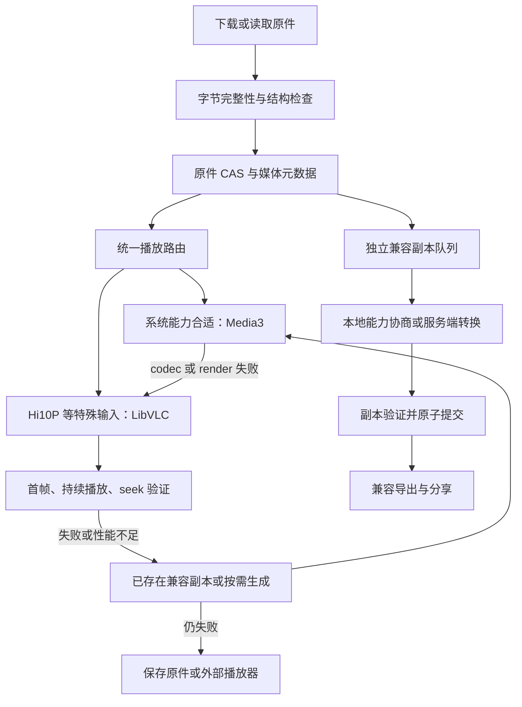

# 多编码播放体系：复核、组件选型与实施建议

日期：2026-09-10。范围：当前 Android App，Expo 57 / React Native 0.86.3。本文为评估交付，不代表播放器迁移或真机修复已完成。

## 1. 决策建议

**建议采用“Media3 常规播放 + LibVLC 特殊编码回退 + 独立兼容副本任务”的体系。先用原生 LibVLC 完成真实样本 PoC，再接入统一播放组件。** 若服务端可控，同时规范新输出为 H.264 8-bit / AAC / MP4，但不能以此替代客户端对历史视频和第三方 API 输出的支持。

当前最大架构问题是将“下载完整”“本机系统解码可用”“兼容副本生成成功”绑定在同一成功路径。只修转码参数，仍不能让 App 正式具备多编码直接播放能力。播放器软解应让原件直接可看；转码主要用于兼容导出、分享以及播放性能不足时的降级。

LibVLC 是优先验证的候选，不是已经在该手机通过验收的承诺。若其在目标设备上的性能、体积或集成表现不达标，第二候选是 libmpv；若不愿承担第二播放引擎，则应选择服务端生成兼容副本，并接受离线特殊编码能力受限。

## 2. 样本实测与证据边界

本轮通过用户提供的签名 URL 下载原件，用本机 MSYS2 FFmpeg / ffprobe 8.1 检查。报告不保存签名查询串。

| 项目 | 本轮实测 |
| --- | --- |
| 文件 | f4554df4-42d8-4594-809a-840a004caee3.mp4 |
| SHA-256 | a1a88c83b3755c212357eefbb4d53ec73a526c98bc6f5f0e2bb95614c66adff3 |
| 文件大小 | 7,793,132 字节 |
| 视频 | H.264 High 10，Level 3.2，avc1.6e0020 |
| 像素 / 色彩 | yuv420p10le；BT.709 primaries / transfer / matrix，SDR |
| 尺寸 / 帧率 | 768×1344，24 fps |
| 时长 / 完整解码帧数 | 10.125 秒 / 243 帧 |
| 音频 | AAC LC，32 kHz，双声道 |
| 严格完整解码 | `-xerror -err_detect explode`，视频与音频一起解码，退出码 0 |
| 当前缩放表达式 | 桌面实测输出 618×1080，yuv420p |
| 桌面兼容副本实验 | libx264 Main / yuv420p，原尺寸 768×1344，243 帧，10.125 秒；输出再次完整解码退出码 0 |

临时证据在 `%TEMP%/autodl-codec-review-20260910/`：`sample.mp4`、`probe.json`、`compatible-desktop.mp4`。另附仓库内精简机器可读证据 `2026-09-10-multi-codec-sample-evidence.json`。

**可以确认**：样本是正常可软解的 10-bit AVC，并非 HEVC，也不是仅因 10-bit 就成为 HDR；无需 tone mapping 即可生成 SDR 8-bit 副本。桌面实验保持了全部视频帧，不能预先将缺帧当作正常现象。

**尚未确认**：用户手机的具体 MediaCodec 能力、实际失败阶段、FFmpegKit AAR 在该机的错误日志、相册实际使用的解码引擎。截图仅证明兼容转换失败且原件已保存，不能区分编码器初始化、解码、滤镜、封装、输出校验等失败。桌面 libx264 成功不代表 Android h264_mediacodec 成功，也不代表已验证系统相册中的文件与 URL 文件哈希相同。

相册可播放说明该手机至少存在一条可用播放路径；厂商私有软解或不同的解码选择是合理解释，但不能据此认定其内部一定使用 FFmpeg，或普通第三方 App 能访问同一能力。

## 3. 当前代码的实际行为

| 位置 | 代码事实 | 影响 |
| --- | --- | --- |
| `mobile/src/media/VideoPlayer.tsx` | `expo-video` 的 VideoView，TextureView；出错后对本地 file URI 再做校验 | 没有独立视频软解引擎；改 View 类型不会补充 codec |
| 已安装 `expo-video/.../player/VideoPlayer.kt:63` | DefaultRenderersFactory 已调用 `setEnableDecoderFallback(true)` | 已有系统候选解码器回退；重复开启无效，不会凭空添加 Hi10P decoder |
| `Media3PlayerActivity.java` | 另一个原生 ExoPlayer Activity | 也不是跨引擎兜底，需与内嵌播放统一策略 |
| `MediaIntegrity.kt:164` | 提取并遍历 samples、检查 AVC profile、findDecoderForFormat、MediaMetadataRetriever 抽取三帧 | 将文件结构和本机系统解码能力混在一起；“系统不支持”不能代表所有播放引擎不支持 |
| `artifactOperation.ts:393` 起 | verifyVideo 失败为 unsupported/decodeFailed 时保留 original checkpoint，再生成兼容副本 | 原件保护已存在，应复用；兼容副本失败仍导致下载业务失败表现 |
| `VideoCompatibility.kt:155` 起 | 只接收 h264 / hevc / vp9；排除 HDR、BT.2020 等；命名软件 decoder | 对这些 SDR 输入可绕过系统源视频解码限制，但 AV1 等未覆盖 |
| `VideoCompatibility.kt:180` 起 | 只有 h264_mediacodec 输出；固定 1920×1080 边界、4 Mbps、baseline | 源可软解并不保证输出编码器可配置；缺少候选编码器 / 输出能力协商 |
| 同文件 `probe()` / `run()` | 非零退出码都归为 MEDIA_COMPATIBILITY_DECODE_FAILED | 丢失失败阶段区分，编码/滤镜/封装错误也可能被叫作解码失败 |
| 同文件输出验证 | 帧数相等、时长容差、完整软解、MediaIntegrity | 应保留完整性保护，补充时间戳诊断，而非无条件允许缺帧 |
| `TaskCardRow.tsx` | 兼容失败使用 DOWNLOAD_FAILED，并可保存原件 | 正是截图现象；需要状态拆分，不能只换播放器 View |

依赖还有一个维护点：App 显式声明 Media3 1.8.1，已安装 expo-video 57.0.3 声明 1.9.0。最终版本应以 Gradle dependencyInsight 为准；本轮未解析实际构建依赖图。迁移时统一版本，避免将声明版本当成实际运行版本。此差异不是已证实的样本失败原因。

当前转码至少包含完整源解码、源 count_frames、转码、输出 count_frames、完整输出解码，末尾还有系统抽帧，TS 侧再次校验。其成本显著多于一次转码；不能承诺固定 1–2 秒。

## 4. 对前一轮报告的重要修正

前一轮报告作为待复核材料，不将其中“立即实施”等措辞视为本次执行指令。

1. **618×1080 已证实，但“所有 AVC 编码器强制 16 对齐、因此必崩溃”不成立。** 编码宏块与公开输入尺寸约束不是一回事。应查询候选编码器的 widthAlignment / heightAlignment、尺寸与帧率联合能力，再在真机配置验证。16 对齐可以作为特定设备降级策略，不能作为根因证明。[Android VideoCapabilities](https://developer.android.com/reference/android/media/MediaCodecInfo.VideoCapabilities)
2. **Media3 官方 FFmpeg 模块是音频 renderer。** 不能添加一个依赖就得到 H.264 High 10 视频软解。自定义视频 Renderer 需要解码、帧输出、Surface、色彩、时钟同步、seek/flush、生命周期等完整工程，不应评为轻量原生桥接。[官方模块 README](https://github.com/androidx/media/tree/release/libraries/decoder_ffmpeg)
3. **已有 FFmpegKit 不等于能零成本接到 Media3。** CLI/session API 不是 Media3 帧接口；FFmpegKit 与 LibVLC 的 FFmpeg 构建也不保证 ABI 可共用，不能直接删除“重复”so。
4. **OpenH264 不等于无条件专利免责或 100% 转码成功。** 源代码授权与 Cisco 二进制的专利许可条件不同；自编译或重新分发不能直接套用二进制许可结论。引入它还会产生构建、包体与性能成本。[OpenH264 FAQ](https://www.openh264.org/faq.html)
5. **不建议先放宽 ±2 帧来消除报错。** 本例桌面转码可以保持 243 帧；需先查明丢帧、时间戳与 EOS 行为。VFR 或有意帧率转换应制定单独规则，保留尾段、音画同步与完整解码检查。
6. **移除能力拒绝不自动获得新 decoder。** 正确做法是将判断限定到特定引擎，并继续尝试其他引擎；文件结构错误仍须阻断。
7. “CPU 不足 5%”“全格式通吃”“全手机 100%”“固定增加 20–30 MB”“必定秒开”等均缺少本项目实测依据，不能作为选型指标。

## 5. 组件与路线比较

| 路线 | 对本例 Hi10P 的实际帮助 | 工程代价 / 限制 | 建议 |
| --- | --- | --- | --- |
| 继续 expo-video / 升级 Media3 / 改 TextureView | 不新增 Hi10P decoder；升级可修引擎缺陷 | 最低成本，但不是 codec 覆盖方案 | 保留为常规播放路径 |
| 换 react-native-video | 常规 Android 实现仍用 ExoPlayer，单纯换 RN 包不能扩大底层解码能力 | 重新适配 API、事件、控件，但核心限制仍在 | 不因本问题单独迁移 |
| 原生 LibVLC + 小型 Expo 原生 View/模块 | 提供独立软件视频解码路径，适合验证 Hi10P 原件直接播放 | 第二引擎、native 库体积、音频焦点、Surface、全屏和事件适配 | **优先 PoC，生产建议按需回退** |
| react-native-vlc-media-player | 同样通过 LibVLC 获得能力，原型较快 | 当前 master 构建引用 LibVLC 3.6.3，含旧 Gradle 插件与动态 RN 依赖；RN 0.86 / Release / 16KB 需实测 | 可用于原型；不能未经验证就当即插即用方案 |
| libmpv + 自建桥接 | 独立软解、渲染与较多高级控制能力 | 原生构建与配置复杂；mpv-android 本身不是可导入 AAR；许可依构建变化 | 第二候选，适合未来更强媒体能力 |
| Media3 自定义 FFmpeg 视频 Renderer | 技术上可实现 Hi10P，能保留 Media3 播放模型 | 维护解码与渲染实现、JNI、同步和版本耦合，已有 CLI API 不够 | 不作为本项目第一阶段 |
| Media3 VP9 / AV1 软件扩展 | 可针对相应编码补能力 | 不解决 AVC High 10 | 有对应需求时单独评估 |
| 加固现有本地转码 | 成功后产生可供 Media3 播放及分享的副本 | CPU、存储、耗时、硬件编码仍可能失败 | 作为独立副本能力保留 |
| 改用 Media3 Transformer 转码 | 默认仍依赖 MediaCodec 解码和编码 | 不能自动绕开 Hi10P 的系统 decoder 缺口 | 不作为直接替代修复 |
| 服务端归一化 / 双版本输出 | 对新任务和历史可访问原件可靠地产生兼容副本 | 需服务端控制、算力、队列和资产生命周期管理 | 可控时同时推进 |
| ACTION_VIEW 外部播放器 | 利用手机上另一应用的能力 | 无可用 handler 或目标播放器不支持时仍失败；离开 App | 用户可选最后兜底 |

来源：[React Native Video](https://docs.thewidlarzgroup.com/react-native-video/docs/v6/intro/)、[VLC Android / 引擎与许可证](https://github.com/videolan/vlc-android)、[RN VLC 构建文件](https://github.com/razorRun/react-native-vlc-media-player/blob/master/android/build.gradle)、[mpv-android](https://github.com/mpv-android/mpv-android)、[mpv Copyright](https://github.com/mpv-player/mpv/blob/master/Copyright)、[Media3 格式支持](https://developer.android.com/media/media3/exoplayer/supported-formats)、[Transformer](https://developer.android.com/media/media3/transformer)。在线 master 是调研快照，实施时固定经过验收的 release / commit。

许可选型应区分 VLC 应用与 LibVLC 引擎、RN 包与底层二进制；同理，mpv 默认 GPL 与可选 LGPL 构建不能混淆。现有 FFmpegKit 是已退休上游的社区 fork，应继续保存版本、AAR hash、构建来源并计划维护升级。[FFmpegKit 上游状态](https://github.com/arthenica/ffmpeg-kit)、[当前 fork](https://github.com/JamaisMagic/ffmpeg-kit-16KB)。具体分发义务需按最终构建核验。

## 6. 建议的正式架构



图中的回退必须有尝试预算：每次播放对每个引擎 / 资产变体至多尝试一次，避免 LibVLC → 副本 → Media3 → LibVLC 无限循环。网络过期、401/403、文件不存在等走数据源恢复，不一律切换 decoder。

### 6.1 拆开状态与验证

- 原件状态：missing / downloading / stored / invalid。stored 表示字节与结构已通过规定检查，不等同于所有引擎都可解码。
- 播放状态：unknown / probing / ready / failed，并记录 engine、decoder、reason、profile、设备构建版本。
- 副本状态：notRequested / queued / converting / ready / failed。失败不再覆盖原件下载成功。
- 导出状态：按 original / compatible 变体分别记录，避免“原件已保存”被误认为兼容副本已保存。

`probeContainer` 与 `probePlayback(engine)` 分离；不能用 MediaMetadataRetriever 成功作为 LibVLC 播放前提。结构检查也应明确支持哪些容器，系统 extractor 不认识容器应归为探测能力不足，必要时由 FFprobe 补探测，不能直接标损坏。

缩略图也要有 FFmpeg/LibVLC 可用路径或占位图；否则会出现视频能播但封面生成阻断入库的问题。LibVLC first-frame 事件必须代表实际画面输出，不只依赖“Playing”状态。

### 6.2 统一播放器接口

在现有 VideoPlayer 外建立 MediaPlaybackHost；内部选择 ExpoVideoBackend / LibVlcBackend。稳定契约包含 source、headers、本地 URI、play/pause/seek、position、duration、firstFrame、ended、error、fullscreen。RN 页面不直接判断 codec。

已知 Hi10P 可直接选 LibVLC；一般文件先走 Media3。出现 codec 初始化/解码/渲染错误才进行跨引擎回退。切换时释放旧播放器和音频焦点，恢复位置、播放意图、静音及倍速；不要在列表里同时启动多个软解实例。全屏也必须保持相同引擎，不能内嵌用 VLC、全屏又回 Media3。

`file://` 和 `content://` 都要验证：文件描述符的生命周期、seek 能力、权限、应用重启后的可读性。不能将任意 content URI 简单转换成路径。外部播放器通过 content URI + 临时读权限打开，捕获无 handler 情况。

能力缓存键包含样本/codec 参数、引擎版本、设备系统版本；系统更新或引擎升级后失效。缓存失败不能永久剥夺用户手动重试。

### 6.3 改造转码而不破坏原件保护

复用现有 original checkpoint、SHA-256、CAS 原子提交、取消 attempt、恢复和去重机制。派生副本键使用 source hash + 转换策略版本；兼容失败可重试本地转换，不重新消耗签名 URL 下载。

优先查询设备 AVC 编码器能力并尝试保留原尺寸；限制用长边 / 短边和设备联合能力表示。缩放后满足 chroma 偶数与具体编码器对齐要求，并显式处理 SAR / DAR / rotation，不能为了对齐拉伸画面。协商 profile、level、帧率、bitrate、输入颜色格式；配置失败可尝试另一个候选编码器或更低输出档位，次数有界。

每个阶段记录独立错误：sourceProbe、sourceDecode、filter、encoderConfigure、encode、mux、outputProbe、outputDecode、platformPlaybackProbe。保存经过脱敏且有长度上限的 FFmpeg stderr、return code、输入/输出参数、codec 名称与 diagnosticInfo；不要记录签名 URL。这样才能判断当前截图究竟是哪类错误。

保持严格完整解码与截断保护；优化重复扫描前先定义完整性契约。对 VFR、帧率转换和音频 priming 单独制定时间轴规则，检查视频尾帧、时长、A/V offset；不能用统一 ±2 帧替代这些检查。

如需无硬件编码器依赖的本地保底，另做 OpenH264 或合规 x264 构建评估；不要将 OpenH264 当作 High10 输入解码器，输入仍使用 FFmpeg h264 软解。离线编码失败时也应允许直接软解播放原件。

### 6.4 服务端与导出

可控 ComfyUI 输出端验证实际输出像素格式，优先 MP4 + H.264 8-bit 4:2:0 + AAC，按目标设备档位约束 profile/level、尺寸、帧率和码率；不只修改文件扩展名或 MIME。保留 faststart 与色彩/旋转信息。需要高质量原件时返回 original 与 compatible 两个资产及编码元数据。

以下是本样本已验证的桌面/服务端方向命令，不是当前 Android min AAR 可直接执行的命令：

```sh
ffmpeg -v error -nostdin -xerror -err_detect explode -threads 2 -c:v h264 \
  -i sample.mp4 -map 0:v:0 -map '0:a:0?' -vf format=yuv420p \
  -c:v libx264 -preset fast -crf 20 -profile:v main -fps_mode passthrough \
  -c:a aac -b:a 128k -movflags +faststart compatible.mp4
```

这条命令针对已验证的 SDR 样本；不是 HDR/Dolby Vision 通用转换处方。第三方 API 不可控时，可在自己的资产处理层生成副本，但需先持久化原件，不能依赖稍后仍有效的签名 URL。

## 7. 支持边界与验收

“多编码支持”应公开为容器 × codec/profile × bit depth/chroma × 尺寸/帧率 × 色彩的矩阵，不能只写支持 MP4。

| 第一阶段目标 | 播放路径 | 副本策略 |
| --- | --- | --- |
| AVC Baseline/Main/High，8-bit 4:2:0 SDR | Media3，异常时 LibVLC | 默认不转码 |
| AVC High 10，10-bit 4:2:0 SDR（本例） | LibVLC 软件解码重点验收 | 分享需要时降为 8-bit |
| HEVC Main/Main10 SDR | 系统支持优先，LibVLC 回退实测 | 按需 AVC 副本 |
| VP9 8/10-bit SDR | 系统支持优先，LibVLC 回退实测 | 按需 AVC 副本 |
| AV1 SDR | 在锁定二进制确认 decoder 后验收；不能因 VLC 名称而默认支持 | 当前转码白名单需扩展并验证构建 |
| HDR10/HLG/Dolby Vision、4:2:2/4:4:4、12-bit、超高分辨率 | 暂列条件支持/后续阶段 | 单独验证显示链路、tone mapping；保留原件，不静默错误降色 |

PoC 在用户故障机、至少一台不同 SoC 真机和 16KB page-size 环境验证。模拟器测试补充构建/流程覆盖，不能替代故障真机。

1. 使用本例 SHA-256 对应原件，验证首帧、从头至尾、音画同步、末帧、拖动、重播、横竖屏、全屏、后台返回和连续打开/关闭。强制软件路径证明不是碰巧使用了系统 decoder。
2. 覆盖普通 AVC、HEVC Main10 SDR、VP9、AV1、HDR、无音轨、VFR、rotation、长视频、截断文件、过期 URL 与 content URI；HDR 条件支持必须给出明确用户结果。
3. 采集首帧耗时 P50/P95、掉帧、CPU、峰值内存、发热和同机能耗对比。可设本地本例首帧 P95 ≤2 秒、播放掉帧率 <1% 为候选门槛，确认设备范围后定稿；这些是验收目标，不是本轮成绩。
4. 对 arm64 release 产物比较压缩下载体积/安装体积/增量；检查所有 so 的 ELF 和 ZIP 对齐并在 16KB 环境实际运行；检查 FFmpegKit/LibVLC/C++ runtime 的 native 冲突，不能只凭依赖名称确认兼容。
5. 验证转换失败仍显示“原件已下载，可播放/保存”；删除副本不删除原件；重试不重复下载；进程死亡和取消不发布半成品；切换播放引擎不重复出声、不泄漏 Surface。

## 8. 实施顺序与交付门槛

以下是单名熟悉 RN/Android 的工程师、正常构建环境下的粗略工作量，不是交付承诺：

| 阶段 | 交付 | 估算 |
| --- | --- | --- |
| P0 诊断 | 补阶段化错误、在故障机重现当前转码、记录 encoder capabilities；移除未经证实的根因结论 | 1–2 人日 |
| P1 引擎 PoC | 原生 LibVLC 播放本样本；file/content、强制软解、seek、音画同步与 release/16KB 验证 | 2–4 人日 |
| P2 正式集成 | 统一播放路由、全屏/生命周期、原件/副本/导出状态拆分、缩略图回退及迁移测试 | 5–10 人日 |
| P3 副本完善 | 编码能力协商、受控降级、诊断与恢复；服务端路径视控制权限另估 | 3–6 人日 |

自定义 Media3 视频软解 Renderer 应按数周级独立引擎工程估算，不能与上述 LibVLC PoC 的工作量混为一谈。若 LibVLC PoC 不达标，再评 libmpv 或服务端优先；不应直接全面替换播放器后才测真实样本。

本轮已完成代码审查、官方来源调研、样本完整软解及桌面兼容副本实验。未修改 App 行为、未安装媒体新依赖、未运行故障真机 Android 转码或 LibVLC PoC。**当前确切转码失败原因仍待设备日志定位；推荐架构不依赖对该原因的猜测。**
