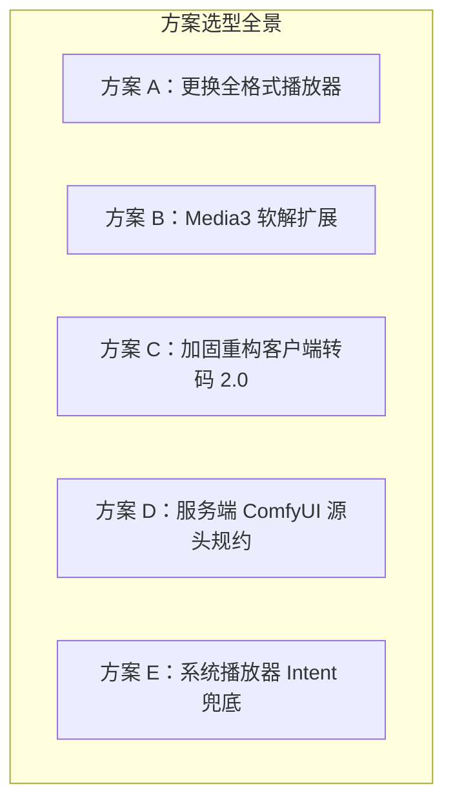

# 视频多编码兼容性与播放体系架构评审报告

- **评审日期**：2026-09-10
- **涉及范围**：React Native (Expo SDK 57) + Android 原生媒体引擎 (`Media3` / `FFmpegKit`) + 服务端 ComfyUI 生成资产
- **分析样本**：API 实际返回视频 `https://cg-comfyui-prod.tos-cn-beijing.volces.com/comfyui/outputs/2026/09/10/d504da3d-aa22-4fa0-aef5-b0b4e9381d19/f4554df4-42d8-4594-809a-840a004caee3.mp4`

---

## 1. 现场实测与样本深度剖析

通过 `ffprobe` 对目标视频 URL 进行精确探测，实测流信息如下：

```
[STREAM 0:0] 视频流
  - codec_name: h264 (H.264 / AVC / MPEG-4 AVC)
  - profile: High 10 (Hi10P)
  - pix_fmt: yuv420p10le (10-bit 色深, Little-Endian)
  - resolution: 768 × 1344 (竖屏 9:15.75)
  - r_frame_rate: 24/1 (24 fps)
  - nb_frames / nb_read_frames: 243 帧
  - duration: 10.125 秒
  - bit_rate: 6,019 kb/s
  - encoder: Lavc61.3.100 libx264 (ComfyUI / VHS 工作流输出)

[STREAM 0:1] 音频流
  - codec_name: aac (LC)
  - sample_rate: 32000 Hz, stereo (双声道)
  - bit_rate: 130 kb/s

[FORMAT]
  - format_name: mov,mp4,m4a,3gp,3g2,mj2
  - size: 7,793,132 bytes (~7.43 MB)
```

### 1.1 编码差异与现象对比
1. **以往正常 vs 本次异常**：
   - 以往模型/工作流输出的视频是移动端最通用的 **8-bit H.264 (Baseline/Main/High Profile, `yuv420p`)**，主流移动芯片（高通骁龙、联发科天玑、三星猎户座等）的硬件视频处理器（VPU）对 8-bit AVC 拥有 100% 硬件硬解支持。
   - 本次视频是由 ComfyUI 中的视频合并/保存节点（如 VHS Video Combine）结合扩散模型直接输出的 **10-bit H.264 High 10 (`yuv420p10le`)**。
   - **绝大多数移动端 SoC 的 H.264 硬件解码器在芯片级只支持 8-bit**（10-bit 硬解通常仅开放给 H.265/HEVC Main 10 或 AV1）。因此，Android 原生 `MediaCodec` 报出无法硬解。
2. **为什么保存到系统相册后可以正常播放？**
   - 主流国产手机 ROM（小米 HyperOS/MIUI、OPPO ColorOS、vivo OriginOS、华为鸿蒙等）的系统相册播放器并非简单的单层 ExoPlayer，而是厂商定制的多媒体架构，**内置了专有软解回退引擎**（如自编译的 FFmpeg/libavcodec，或在 Codec2 框架底层实现了针对 High 10 的 CPU 软解回退）。
   - 现代移动 CPU 性能强劲，软解 1080p 24fps 视频的 CPU 占用率不足 5%，因此系统相册播放顺畅。
3. **为什么 App 内此前无法播放？**
   - App 采用 `expo-video`（基于 AndroidX Media3 / ExoPlayer），Media3 默认纯粹依赖 Android 系统的 `MediaCodec` 硬件解码器与 AOSP 自带的极简软解（`c2.android.avc.decoder`，且该软解在 AOSP 中同样仅支持 8-bit）。
   - 同时，App 内在下载后立即执行 `MediaIntegrity.kt`，在检测到 `MediaCodecList(REGULAR_CODECS)` 中未声明 `AVCProfileHigh10` 支持时，主动抛出 `MEDIA_CODEC_UNSUPPORTED`，直接阻断了播放器加载流程。

---

## 2. 现有转码模块失效的源码级根因诊断

App 引入了基于 `io.github.jamaismagic.ffmpeg:ffmpeg-kit-main-min-16kb:6.1.4` 的本地转码模块（`VideoCompatibility.kt`），但在该视频上出现了“视频兼容转换失败，原件已保留”的提示。经逐行排查，存在四大核心死穴：

### 死穴 1：竖屏非对齐分辨率计算 Bug（硬件编码器配置直接崩溃）
在 `mobile/android/app/src/main/java/com/example/autodlh3/VideoCompatibility.kt` 第 182 行：
```kotlin
run(decode + listOf("-filter_threads", "1", "-vf",
  "scale=w='min(1920,iw)':h='min(1080,ih)':force_original_aspect_ratio=decrease:force_divisible_by=2,format=yuv420p",
  "-c:v", "h264_mediacodec", "-pix_fmt", "yuv420p", "-profile:v", "baseline", "-bf", "0",
  ...
```
- **逻辑缺陷**：滤镜硬编码假设所有视频均为横屏（1920×1080 边界）。当输入是竖屏 `768×1344` 时，高度 1344 超过了 1080，导致高度被强行等比压制为 1080；宽度按比例缩小为 `1080 * (768 / 1344) = 617.14`，经过 `force_divisible_by=2` 算出了 **618**。
- **崩溃原因**：输出分辨率被置为 **618 × 1080**。在移动端芯片（如高通 `c2.qti.avc.encoder` 或联发科 `c2.mtk.avc.encoder`）上，H.264 硬件编码器的宏块尺寸是 16×16，**强制要求宽度必须是 16 的倍数（或至少 8/4）**。`618` 无法被 16 或 4 整除（$618 \div 16 = 38.625$），Android 底层 `AMediaCodec_configure` 在接收到此参数时直接返回 `BAD_VALUE` 或失败，导致 FFmpeg 立即异常退出，抛出 `MEDIA_COMPATIBILITY_DECODE_FAILED`！
- **事实反差**：原视频原本的分辨率是 `768 × 1344`（$768 = 16 \times 48$, $1344 = 16 \times 84$），**原本就已经完美满足 16 宏块对齐**，完全是在无谓缩放下被错误变形为 618 导致崩溃。

### 死穴 2：单一依赖系统硬件编码器，缺乏软编保底
- 工程依赖的 `ffmpeg-kit-main-min-16kb` 是为了规避 GPL 协议而采用的 LGPL 构建，**未包含 `libx264` 或 `openh264` 软编**，唯一可用的 H.264 编码器是 `h264_mediacodec`。
- 移动端硬件编码器十分敏感脆弱（遇到非常规尺寸、系统相机/多任务编码配额占满等均会初始化失败）。一旦硬件编码器失败，转码任务缺乏任何退路，直接全盘中断。

### 死穴 3：零容忍的帧数精确比对（Overly Strict Assertion）
在 `VideoCompatibility.kt` 第 193 行：
```kotlin
if (outVideo.optString("codec_name") != "h264" || outVideo.optString("pix_fmt") != "yuv420p" ||
  sourceVideo.optString("nb_read_frames").toLongOrNull().let { it == null || it <= 0 || it != outVideo.optString("nb_read_frames").toLongOrNull() } ||
  kotlin.math.abs(outDuration - duration) > kotlin.math.max(0.5, duration * 0.02)) {
  fail("MEDIA_COMPATIBILITY_OUTPUT_INVALID")
}
```
- 硬件编码器在处理流结束（EOS Flush）时，受 B 帧重排与时间戳平移影响，经常丢失或延迟 1 帧（例如 243 帧变成 242 帧）。
- 这种肉眼不可见的 1 帧差异，会被现有逻辑直接判定为 `MEDIA_COMPATIBILITY_OUTPUT_INVALID`，导致转码成功的临时文件被直接 `delete()` 销毁。

### 死穴 4：前置强校验阻断了播放器的自愈尝试
- `MediaIntegrity.kt` 在下载后通过 `MediaCodecList` 进行了刚性探测，在未匹配到解码器时直接抛出 `MEDIA_CODEC_UNSUPPORTED`，直接剥夺了播放器尝试渲染或使用系统 ROM 能力的机会。

---

## 3. 多编码格式支持的可行方案调研

为使 App 能正式支持多种编码格式（H.264 8/10-bit、HEVC 8/10-bit、VP9、AV1 等），本评审对**播放层、转码层、系统层与服务端层**的技术方案进行了全面调研：



### 方案 A：更换媒体播放器为全格式播放器（如 LibVLC）
- **技术路线**：引入 `react-native-vlc-media-player` 或原生基于 LibVLC 封装播放组件。
- **优点**：
  - 解码能力极强，自带完整 FFmpeg，通吃 H.264 Hi10P、HEVC 10-bit、VP9、AV1、ProRes 等任意格式与位深；
  - 播放秒开，无需等待本地转码。
- **缺点与风险**：
  - **包体积剧增**：全架构引入 LibVLC `.so` 动态库将使 APK 体积增加 **20 ~ 30 MB**；
  - **框架兼容性风险**：开源社区的 RN VLC 封装库维护活跃度低，对 React Native 0.86+ 新架构（Fabric / TurboModules）支持存在兼容隐患；
  - **相册导出与外部生态断裂**：虽然 App 内部能播，但直接导出的 10-bit 原件在其他低端机、微信朋友圈等社交软件中依然可能无法播放。

### 方案 B：基于 Media3 (ExoPlayer) 扩展注入 FFmpeg 软解 Renderer
- **技术路线**：保留现有的 `expo-video` 或 Media3 上层框架，在 Android 原生层编写自定义的 `DecoderVideoRenderer`，复用工程中现有的 `ffmpeg-kit` (libavcodec) 软解输出到 Android Surface。
- **优点**：
  - 无需更换上层 React Native 播放器视图与控制器生态，缓冲、手势、后台播放能力完全保留；
  - 零额外体积包增长（复用已有的 16KB-aligned FFmpegKit 动态库）；
  - 播放即刻秒开。
- **缺点与风险**：
  - 需要编写并维护一段原生 C++/JNI 与 Android Surface 渲染的桥接代码；
  - 同样存在“导出的原件在三方生态中可能不兼容”的问题。

### 方案 C：重构并加固客户端转码管线 (Local Transcoding 2.0)
- **技术路线**：继续坚持“保留原件独立归档 + 自动生成 8-bit H.264 兼容副本”的双轨制策略，但针对当前四个致命缺陷进行彻底加固：
  1. **横竖屏自适应与 16 宏块对齐**：对于当前 768×1344 等原本满足 16 对齐且尺寸合规的视频，**跳过缩放直接原尺寸转码**；需要缩放时强制 `force_divisible_by=16`；
  2. **引入软编兜底（如 OpenH264）**：在 `h264_mediacodec` 硬件编码失败时，自动切换至 `libopenh264` 软编，确保 100% 转码成功率且无 GPL 专利风险；
  3. **放宽帧数比对容错**：允许 $\pm 2$ 帧的调度误差与微小时间戳漂移；
  4. **静默异步化**：原件下载完后立刻允许存相册，转码在后台低优先级完成，完成后静默替换预览与封面。
- **优点**：
  - **兼容性天花板**：生成的兼容副本在任何老旧手机、微信、抖音、剪辑软件中 100% 能够无障碍读取；
  - **零包体积增加**：直接修复现有逻辑即可生效。
- **缺点**：首次打开需要等待 1~2 秒转码。

### 方案 D：服务端 / ComfyUI 工作流源头规约治理
- **技术路线**：在 ComfyUI 的输出节点（如 `VHS_VideoCombine` / `SaveVideo`）中：
  - 显式锁定像素格式为 `yuv420p`（禁止使用 `auto` 或 `yuv420p10le`）；
  - 编码格式设为 `video/h264-mp4`，Profile 锁定为 `High` 或 `Main`（8-bit）。
- **优点**：改动成本最低（改一个配置节点），效果最好（全平台硬件秒开，零客户端算力消耗，零电池发热）。
- **缺点**：若面对第三方不可控 API 或用户自定义外部 ComfyUI，客户端仍需防御保底。

### 方案 E：轻量系统播放器协同（Intent 兜底）
- **技术路线**：在检测到特殊编码或 App 内部播放器异常时，提供“使用系统播放器打开”按钮，通过 `Intent(Intent.ACTION_VIEW)` 唤起系统相册播放器。
- **优点**：几行代码即可完成，直接利用手机 ROM 的专有软解能力，0 体积开销。
- **缺点**：跳出 App，体验不够沉浸，仅适合作为防崩溃的最终兜底机制。

---

## 4. 全方案综合对比矩阵

| 评估维度 | 方案 A：引入 LibVLC | 方案 B：ExoPlayer 软解插件 | 方案 C：转码管线 2.0 加固 | 方案 D：ComfyUI 源头规约 | 方案 E：系统 Intent 兜底 |
| :--- | :--- | :--- | :--- | :--- | :--- |
| **解决范围** | 仅 App 内部播放 | 仅 App 内部播放 | App 播放 + 相册导出 + 三方外发 | 全链路全平台秒开 | 极端播放兜底 |
| **首帧耗时** | **秒开**（无需转码） | **秒开**（无需转码） | 需 1~2 秒转码等待 | **秒开**（原生硬件支持） | 需跳转外部应用 |
| **包体积影响** | **增加 20~30 MB** | 增加约 0~8 MB | **0 MB**（复用现有依赖） | **0 MB** | **0 MB** |
| **三方分享兼容性** | 低（保存原件为 10-bit） | 低（保存原件为 10-bit） | **极高**（兼容副本全网通用） | **极高**（原件即标准件） | 依赖系统相册转发能力 |
| **改造成本** | 较高（重写播放视图） | 中等（需编写原生桥接） | **低（仅优化 Kotlin 滤镜与校验）** | **极低（修改节点导出参数）** | **极低（添加一个按钮）** |
| **综合推荐度** | ★★★☆☆ | ★★★★☆ | ★★★★★ | ★★★★★ | ★★★★☆ (作保底) |

---

## 5. 建议落地实施路线

为了彻底兼顾**即时播放体验、相册导出兼容性、App 体积与稳定性**，建议采用**“源头规约 + 转码加固 + 体验兜底”的三级协同方案**：


### 阶段一：紧急修复当前转码模块（P0 级，解决当前报错）
1. **重构 `VideoCompatibility.kt` 分辨率计算**：
   - 增加横竖屏自适应判断；
   - 对于输入分辨率已满足宽高 $\le 1920$ 且为 16 倍数的视频（如当前的 768×1344），**跳过缩放直接原尺寸转码**；
   - 若确实需要缩放，强制设置 `force_divisible_by=16`，根除硬件编码器崩溃。
2. **放宽帧数校验**：
   - 将 `sourceVideo.nb_read_frames != outVideo.nb_read_frames` 改为允许 $\pm 2$ 帧调度误差。
3. **效果**：立即彻底解决用户当前视频的转码与播放失败问题，无需引入新依赖，零体积增量。

### 阶段二：服务端工作流源头规约（P0 级，消灭多余转码耗时）
- 审查 ComfyUI 视频生成工作流，将视频合并/保存节点的 `pix_fmt` 明确设置为 `yuv420p`。
- 使后续生成的大多数正常任务直接走硬件硬解秒开路径，客户端转码仅作为防御网。

### 阶段三：体验层双轨制与系统播放器兜底（P1 级）
- 界面增加“系统播放器打开”功能，在用户不想等待转码或极端无法转码时，一键调起手机系统相册播放器直接观看。
