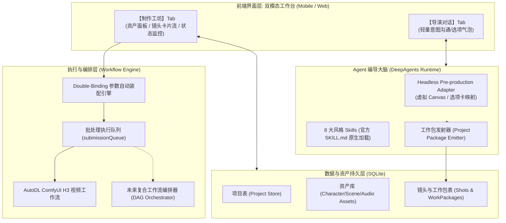

# MiniMax H3 风格 Skill 解耦运行、资产管理与工坊式工作包驱动生成架构审查

> 审查时间：2026-09-04
> 审查背景：在静态审查（见 `docs/superpowers/reviews/2026-09-04-h3-skill-harness-parity-static-review.md`）确认当前移动端 Agent Runtime 无法复刻官方 MiniMax Hub 全套工具链后，用户提出核心诉求：“**不依赖官方 MiniMax Hub，但希望将全部 8 个风格 Skill 的场景设计、Prompt 编写等前期编导能力完整用起来**”。在进一步探讨中，针对“传统 Chatbot 长文本爆炸、多镜头手动挑图/传参体验割裂、角色/场景资产沉淀缺失、工作包如何驱动生成、以及未来多工作流编排与前端界面设计”展开了全链路推演。
> 审查对象：`mobile/src/agent/`、`mobile/src/create/`、`mobile/src/workflows/`、`mobile/src/storage/`、官方 8 个风格 Skill Bundle。
> 审查目标：将本次探讨形成的“思考流程、系统架构决策、功能需求清单与界面规范”沉淀为标准化审查与设计基线文档。

---

## 1. 核心矛盾与考量流程（The Consideration Process）

### 1.1 现状审视：影视工程级信息密度 vs 传统 Chatbot 交互失配

目前移动端的 Prompt 助手本质是一个纯文本 Chatbot。如果强行运行 8 个风格 Skill（如 `3d-animation-short-generator`、`brand-promo-video-generator` 等），会触发三重体验阻断：
1. **长文本瀑布流爆炸**：一个标准的 3D 动画短片企划包含项目简报、角色卡、场景卡、六列标准镜头信息表、秒级动作与运镜分镜，单次输出可达数千字。在手机屏幕上，聊天流瞬间被淹没，核心决策信息极难检索。
2. **多镜头手动人肉搬运与传参**：一个短片包含 4~8 个分镜（S01~SN）。用户需要逐个翻找并复制每个镜头的 Prompt，跳转到创建页，还要为每个镜头**重复上传相同的角色参考图、重复调节相同的 6s 时长和横屏分辨率**，体验极其折磨。
3. **缺乏项目上下文与资产沉淀**：当前对话中的图片属于单次会话附件，镜头 1 传了一次主角 Mia 的照片，镜头 3 又需要重新选择上传，没有“项目级资产库”的概念。

### 1.2 定位跃迁：从“全自动渲染 Harness”到“专业前期总监 + 简化版私有 Hub”

解决上述矛盾的核心思路，是进行**系统定位的降维与聚焦**：
- **不盲目复刻 Hub 的重型成片后端**：不自建复杂的云端实时视频渲染节点、TTS 配音与 BGM 生成集群。
- **吃透 8 个 Skill 沉淀的导演级编导 SOP**：将 8 个 Skill 视为**“AI 创意总监与分镜专家”**，专注于世界观设定、角色/场景卡设计、连续性镜头规划与高质量 H3 结构化提示词编写。
- **构建轻量化私有 Hub（Project Studio）**：通过“本地资产库”与“结构化工作包（Work Package）”，无缝驱动现有的 AutoDL ComfyUI 生成通道，实现“免重复挑图、免手动传参、单镜点播与整包批处理”。

---

## 2. 总体架构设计（Architecture Overview）

系统整体解耦为四大核心分层：

---

## 3. 详细功能需求清单（Requirements Checklist）

### 模块一：前端双模态工作台界面（Dual-Pane / Studio UI）

- [ ] **FR-UI-01 双 Tab / 抽屉式分屏结构**：
  - 提供【导演对话】与【制作工作板】双视图，支持左右滑动或顶部 Tab 无缝切换。
  - 顶部常驻项目摘要条（项目标题、当前阶段：设定中 / 镜头表就绪 / 渲染中、镜头完成进度如 `2/4`）。
- [ ] **FR-UI-02 快捷选项气泡（Quick Choice Chips）**：
  - 在【导演对话】输入框上方，正则匹配 Agent 输出的下一步选项（如 `- [x] 1. 批准故事大纲 (推荐)`），动态渲染为可点击胶囊按钮，点击即自动回复，无缝替代 Hub 的 Choice Card 闸门。
- [ ] **FR-UI-03 资产面板（Asset Deck）**：
  - 集中展示当前项目沉淀的角色卡（Avatar、名称、描述）、场景卡（缩略图、光影锚点）、音频参考。
  - 支持手动上传补充素材，或点击“由生图模型生成”（未来工作流扩展）。
- [ ] **FR-UI-04 镜头卡片流（Shot Render Deck）**：
  - 摒弃大段纯文本，每个分镜（S01~SN）以独立卡片呈现。
  - 卡片包含：镜头 ID、规划时长（如 `6s`）、推荐分辨率（如 `768p横`）、接戏动作摘要、已自动绑定的资产缩略图。
  - 卡片状态机：`[草稿] -> [队列中] -> [生成中 (带进度条)] -> [已完成 (内嵌播放器)] -> [失败/重试]`。
- [ ] **FR-UI-05 操作动作栏**：
  - **单镜点播**：每张分镜卡片右下角提供【生成本镜】按钮，生成完毕原地切换为视频播放器。
  - **整包批跑**：工作板顶部提供【一键生成全部分镜】按钮，一键将所有就绪镜头推入后台队列。
  - **Prompt 检视与复制**：每张卡片提供“查看/复制 H3 Prompt”抽屉，供高级用户微调。

---

### 模块二：项目与资产数据模型（Asset & Project Store）

- [ ] **FR-DS-01 项目表（`projects`）**：
  - 记录 `id`、`title`、`skill_id`（如 `3d-animation-short-generator`）、`status`、`aspect_ratio`、`total_duration`、`created_at`。
- [ ] **FR-DS-02 资产表（`project_assets`）**：
  - 存储属于该项目的资产：`id`、`project_id`、`type` (`character` / `scene` / `audio`)、`name` (如 `Mia`)、`description`、`local_uri` (图片/音频本地文件路径)。
- [ ] **FR-DS-03 分镜与工作包表（`project_shots`）**：
  - 存储结构化分镜：`id`、`project_id`、`shot_id` (`S01`)、`order_index`、`duration`、`resolution`、`prompt`、`negative_prompt`、`bound_asset_ids` (JSON 数组)、`status`、`task_id`、`video_url`、`local_video_uri`。

---

### 模块三：Agent 适配器与结构化工作包发射（Headless Adapter）

- [ ] **FR-AG-01 提示词层无 Hub 运行时适配（System Policy Update）**：
  - 调整 `h3Agent.ts`，解除单一 `integrated_multimodal_description:` 输出约束。
  - 注入 Pre-production 策略：要求 Agent 遇到 Canvas 产物时输出标准结构块；遇到 Choice Card 时输出规范选项列表；完成企划后必须输出结构化项目包。
- [ ] **FR-AG-02 多分镜结构化解析器（`MultiShotPromptParser`）**：
  - 升级 `mobile/src/agent/promptParser.ts`，支持识别并提取多镜头工作包块（JSON Block 或标准分镜 Markdown 格式 `## S01 / 6s — ...`）。
  - 提取后自动落盘入 SQLite `project_shots` 表，并通知前端工作板刷新。

---

### 模块四：参数自动装配与任务驱动引擎（Binding & Dispatch Engine）

- [ ] **FR-EX-01 Double-Binding 标签自动关联**：
  - 扫描分镜中的 `[char:Mia]` 和 `[scene:kitchen]` 标记。
  - 自动根据 `name` 匹配 `project_assets` 表中的对应素材，获取其 `local_uri`。
- [ ] **FR-EX-02 自动组装工作流输入参数**：
  - 直接对接当前 `mobile/src/workflows/definitions/autodl/minimax-h3-i2v-15s.json` 的规范：
    - `prompt` <- 分镜的 H3 提示词；
    - `duration` <- 分镜时长（如 5s/6s）；
    - `resolution` <- 映射为 `768p横` / `768p竖`；
    - `images` <- 自动注入已解析资产的图片列表；
  - **彻底消灭用户在生成表单中反复挑图与调参的操作**。
- [ ] **FR-EX-03 批量入队与执行（利用现有 `submissionQueue.ts`）**：
  - 调用现有的任务队列与状态同步机制，支持镜头顺序调度与 AutoDL 轮询。

---

### 模块五：未来多工作流整合与自动编排（DAG Orchestration）

- [ ] **FR-WF-01 复合工作流抽象（Composite Workflow DAG）**：
  - 在现有 `atomic` 工作流基础上，支持将工作包定义为 DAG：
    1. 节点 1：生图工作流（Flux/SDXL）-> 产出角色/场景图 -> 回填资产库；
    2. 节点 2：H3 视频生成工作流（消费资产图与 Prompt）-> 产出各分镜 MP4；
    3. 节点 3：TTS 配音与 BGM 工作流 -> 产出对白与音轨；
    4. 节点 4：FFmpeg 剪辑节点 -> 自动串联分镜、混音闪避、输出最终成片。
- [ ] **FR-WF-02 阶段式自动化流转**：
  - 前置资产就绪后自动唤醒下游视频生成，全部分镜就绪后自动触发剪辑拼接。

---

## 4. 实施演进路线图（Roadmap）

| 阶段 | 核心任务 | 开发周期 | 交付成果 |
| :--- | :--- | :--- | :--- |
| **Phase 1：分镜抽屉与一键带入（解决多 Prompt 消费痛点）** | 1. 修改 `h3Agent.ts` 系统策略，放开多分镜输出。 2. 升级 `promptParser.ts` 支持多镜头解析。 3. 前端实现【分镜抽屉】与选项快捷气泡，支持“一键将选中镜头（含时长、分辨率、Prompt）带入现有 CreateForm”。 | 2 ~ 3 天 | 用户可以完整跑完 8 个 Skill 的前期编导，并在抽屉中按分镜一键回填生成页，无需手动复制长文。 |
| **Phase 2：本地资产库与工作板原地生成（简化版 Hub 闭环）** | 1. SQLite 建立 `projects` 与 `project_assets` 简易表。 2. 实现双模态工作台（Chat + Studio 板块）。 3. 实现 Double-Binding 图片自动装配，分镜卡片支持直接内嵌提交 AutoDL，原地播放。 | 1 ~ 2 周 | 告别重复传图，在工作板内形成“设定 -> 分镜 -> 视频”可视化工程看板。 |
| **Phase 3：多工作流上线与 DAG 自动编排（自建独立影视工坊）** | 1. 接入生图工作流（Flux）与配音/剪辑节点。 2. 工作流运行时支持 DAG 自动流转与整包全自动拼接。 | 待多工作流就绪 | 摆脱 MiniMax Hub，具备高自主权的一体化 AI 影视制作终端。 |

---

## 5. 结论

本方案成功回答了“不想复刻 Hub 全部繁重底层，又想榨干 8 个风格 Skill 编导能力”的技术路径：
1. **架构极度自洽**：不需要重写官方 Skill，仅通过系统指令适配，就能释放其顶级的分镜与场景规划资产；
2. **体验代际跃升**：通过“双模态工作台”解决 Chat 界面长文本灾难，通过“资产库与工作包”解决人肉传图调参痛点；
3. **技术平滑演进**：紧密结合当前代码库已有的 `CreateForm`、`submissionQueue` 与 `autodl.minimax-h3.i2v-15s` 工作流体系，具备即刻实施落地的可行性。
