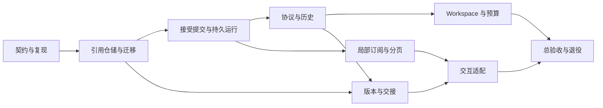

# Prompt Assistant Foundation Remediation Implementation Plan

> **实施进展（2026-09-07）**：用户已认可并授权修正。代码、结构取舍和验证边界见[实施记录](../../reviews/2026-09-07-prompt-assistant-remediation-results.md)。以下保留为原规划及验收要求，未将未执行的设备/真实模型验证或尚未完成的细项批量勾选。

- [x] R0-R3 核心契约、实体存储、提交事务、恢复与协议修正已实现并通过自动化验证。
- [x] R4-R6 工作区、摘要 provenance、预算、展示隔离、产物及交接所有权已实现并通过自动化验证。
- [x] R7 代码侧交互修正及 R8 全量 Jest、TypeScript、工作流契约、Android bundle 验证通过。
- [ ] R8 真机交互/性能/原生进程恢复及真实 LLM 效果验收。限制及结构调整以实施记录为准。

> **For agentic workers:** REQUIRED SUB-SKILL: Use superpowers:executing-plans to implement this plan task-by-task. Steps use checkbox (`- [ ]`) syntax for tracking. 本文为待实施规划，不能将核验通过视为修复完成。

**Goal:** 修复第三轮核验确认的 Agent 正确性和交互缺陷，并建立可恢复、引用化、按实体更新的会话模型，避免重复迁移和长期双写。

**Architecture:** 应用 repository 拥有用户可见 transcript、submission/run、版本、composer 和素材所有权；AG-UI/DeepAgents 负责协议及执行，通过单一适配边界读写应用模型。静态技能只读，创作 workspace 与摘要按 revision 保存，展示订阅与持久化调度分离。

**Tech Stack:** Expo 57 / React Native 0.86 / React 19、SQLite（现有 schema v8、withWriteTransaction）、DeepAgents 1.13.2、AG-UI client 0.0.57、CopilotKit RN 1.69.3、现有 CAS、Jest 和真实 AbstractAgent 集成测试。

**依据：** [独立核验及全量映射](../reviews/2026-09-07-prompt-assistant-round3-verification.md)。日期 2026-09-07；基线 `4ed379e4`。本轮产出只含规划、核验和审计探针。

---

## 1. 路线选择

| 路线 | 收益 | 代价与风险 | 结论 |
| --- | --- | --- | --- |
| 按原表逐条小修，架构后置 | 个别体验较快改善 | 文件 URI 过渡存储、版本截断、重复状态合并会成为下一次迁移输入；提交错误仍跨三层猜测 | 不作为总体路线 |
| 整体换 Agent/聊天框架，全面 event sourcing | 可重新定义所有层 | 现有流式、取消、恢复、工作流和原生兼容资产重做；迁移面最大且非必要 | 不采用 |
| **保留框架，按最终数据契约分阶段替换** | 复用已有运行和存储能力，每阶段有可验证结果 | 要先明确所有权、兼容读和退出条件 | **推荐** |

不将“没有技术债”作为不可验证承诺。完成标准是：每项已知风险有唯一归属、迁移可恢复、没有永久双写、没有复制的解析/配额/状态机、数据删除有引用依据，且关键路径有故障注入和设备证据。

## 2. 必须维持的约束

1. 一次被接受的提交对应一个稳定 userMessageId 和至少一个 run；submissionId 幂等。用户消息与初始 run 在同一事务中持久化，成功回执才表示“已接受”。
2. 未接受的失败保留原草稿；已接受后的模型失败留在对应 run。晚到错误不能覆盖用户已经输入的新草稿；重试复用目标 user，产生新 runId。
3. 每个 run 只有一个终态；取消以 `RUN_ERROR(code=abort)` 对外结束，应用映射为 cancelled，之后迟到事件全部拒绝。消息 END 只表示不再收文本，工具 END 只表示参数流结束，不表示执行成功。
4. UI 可见部分输出不因 failed/cancelled 状态被整体丢弃。模型输入经过统一历史投影，保留文本并修复非法工具配对；不把错误记录伪装成成功工具调用。
5. 图片二进制不进入新 messages/state/versions/drafts JSON。assetId 标识一个素材实例，sha256 标识内容，binding.ordinal 标识在该产物中的序号，三者不可混用。
6. CAS 文件只有在所有 owner 释放后才可 GC。用户仍保留的版本、未提交表单、可重试任务都算 owner；任务终态不自动代表输入可删除。
7. 一个版本一旦确认即不可变，恢复生成新版本；分页不是删历史，cache eviction 不是数据删除。
8. graph 状态不能覆盖 composer/readAt/selectedVersion 等应用状态。图更新只进入版本化 workspace codec，不能把任意 `input.state` 全量写回。
9. 数据事件按序即时应用；文本展示允许合并，接受/停止/错误/终态立即刷新。落盘节奏与 UI 节奏独立。
10. 损坏历史隔离并可恢复；保留只读诊断和原数据，不能静默转成空会话再覆盖保存。

## 3. 模块及数据所有权

所有路径相对仓库根目录；“新建”为规划文件，尚未实现。沿用现有 `src/agent` 组织方式，不新建通用 Agent 框架。

| 模块 | 唯一职责 | 修改面 |
| --- | --- | --- |
| `mobile/src/agent/threadStore.ts` | 线程摘要、消息/运行/版本分页仓储，事务命令入口 | 替换全量快照读写 API；保留短期 legacy importer 入口 |
| `mobile/src/agent/threadMigration.ts`（新） | v1 JSON → v2 实体迁移，逐线程幂等、校验、恢复 | 不在 UI/render 中迁移 |
| `mobile/src/agent/agentRecords.ts`（新） | 严格 DTO、schema version、引用和序列/修订号 | 只含领域结构，不依赖 React/SDK |
| `mobile/src/agent/attachmentStore.ts`（新） | 导入、限额、asset 解析、CAS owner 协调 | 替代两套附件队列；复用 media CAS |
| `mobile/src/media/cas.ts`、`casRepository.ts` | 内容寻址文件发布/完整性/引用/GC | 加受控本地输入导入，保留既有 task artifact 契约 |
| `mobile/src/agent/submissionCommands.ts`（新） | accept/retry/restore 命令和提交回执 | 复用 `LocalCopilotKitProvider` 的 runAgent 能力 |
| `mobile/src/agent/runtimeStore.ts`、`runState.ts` | 实例生命周期、纯 run reducer、分域通知、flush 结果 | 唯一运行状态拥有者 |
| `mobile/src/agent/deepAgentStream.ts`、`aguiAgent.ts` | 流协议适配、终态门、SDK 对接 | 不承担素材保存/版本创建/UI 草稿逻辑 |
| `mobile/src/agent/modelTranscript.ts`（新） | transcript 选择、tool 配对修复、素材按需物化 | 普通追问和 retry 共用同一规范化器 |
| `mobile/src/agent/agentWorkspace.ts`（新） | 静态 skills + 可变文件/todos + 摘要恢复及 revision | 隔离 DeepAgents 内部字段与库版本差异 |
| `mobile/src/agent/timelineProjection.ts`（新） | 变化消息的派生结果、解析缓存、行对象稳定性 | 不落库，不持有无限缓存 |
| `mobile/src/agent/promptParser.ts`、`promptVersions.ts` | 单一产物解析、不可变版本领域逻辑 | parser 返回候选和 range；版本不再由 UI effect 创建 |
| `mobile/src/agent/promptBindings.ts`（新） | 编号/别名/显式素材绑定及引用验证 | panel、handoff、migration 共用 |
| `mobile/src/agent/promptDraft.ts`、`promptHandoff.ts` | 可恢复交接命令和 owner 转移 | DTO 不含二进制 |
| `mobile/src/create/CreateForm.tsx`、`submissionCommand.ts` | 交接应用确认及任务提交事务 | 表单持有资产直到任务原子接管/显式丢弃 |
| `mobile/src/ui/theme.ts`、`DraggableSheet.tsx` | 全应用主题及模态/键盘交互 | 统一 token；不逐页发明色板 |

建议核心契约如下；实现阶段在 `agentRecords.ts` 定义并由调用者共享，禁止多处手写同形类型：

```ts
export type ImageBinding = { attachmentId: string; ordinal: number; displayName: string };
export type AssetRecord = {
  id: string; sha256: string; mime: string; byteSize: number; filename?: string;
};
export type AcceptSubmissionResult =
  | { kind: 'accepted'; submissionId: string; userMessageId: string; runId: string }
  | { kind: 'rejected'; submissionId: string; reason: string; draftRevision: number };
export type FlushResult =
  | { kind: 'saved'; durableRevision: number }
  | { kind: 'failed'; dirtyRevision: number; error: Error };
export type PromptArtifactCandidate = {
  id: string; sourceMessageId: string; promptText: string;
  range: { start: number; end: number }; // UTF-16 offsets in original message text
};
export type GraphWorkspaceRecord = {
  schemaVersion: 1; graphVersion: string; revision: number;
  files: Record<string, { blobSha256: string }>;
  todos: Array<{ content: string; status: 'pending' | 'in_progress' | 'completed' }>;
  summary?: { prefixHash: string; throughMessageId: string; payload: unknown };
};
```

`payload: unknown` 只在 workspace codec 内按锁定库版本验证后使用，不能作为无校验存储通道；文件内容走 CAS，摘要是受字节预算限制的文本/结构。`uri` 在展示/传输适配时解析，不持久化为资产身份。

## 4. 存储和迁移设计

沿用 `artifact_blobs` / `artifact_blob_refs`，不新增第二套 blob 表和 GC。新增实体如下，索引包含 thread_id 与稳定 sequence；createdAt 用于展示，sequence 用于排序，不因设备时钟回拨改变因果顺序。

| 实体 | 主键 / 内容 | 关键规则 |
| --- | --- | --- |
| `agent_thread_index` | thread_id；title、message_count、last_run_status、read_revision、updated_at、format_version | 历史只读投影，不拉全文；新线程 INSERT 冲突报错 |
| `agent_messages` | (thread_id,id)；sequence、revision、role、content_json、run_id | 新建 append，流式只更新活动消息；content_json 禁 data URI |
| `agent_runs` | (thread_id,id)；submission_id、user_message_id、retry_of、status、base_workspace_revision、last_activity_at | queued/running/终态；重试新记录，来源保留 |
| `agent_run_tools` | (thread_id,run_id,id)；message_id、status、summary、args reference | args 只拥有一份，结束与成功独立 |
| `agent_versions` | (thread_id,id)；source_message_id、artifact_id、prompt_text、bindings_json、parameters_json、restored_from | 不可变；来源 artifact 唯一，恢复 commandId 唯一 |
| `agent_composers` | thread_id；revision、text、bindings_json | 独立更新，不把 draft 送入 graph state |
| `agent_attachments` | id；sha256、mime、byte_size、filename | 多实例可同 hash，编号属于绑定而非 blob |
| `agent_workspace_revisions` | (thread_id,revision)；codec_version、manifest_json、run_id | 记录执行可见状态；被 retry 引用的基线不可清理 |
| `agent_submissions` | id；thread_id、user_message_id、run_id、draft_revision | 事务接受与幂等约束；用于冷启动恢复 |
| `agent_handoffs` | id；source_json、prompt、bindings_json、parameters_json、status、revision | ready/applied/submitted/discarded/expired；有表单持有状态 |

DDL 只进入 `storage/schema.ts` 与 `storage/migrations/v9AgentRecords.ts`；同步更新 `APP_TABLES`、`migrations/runner.ts`、`schemaOwnership.test.ts`。仓储使用现有 `withWriteTransaction` 和 writable/recovery 保护，不在 render 或构造器建表。

示例唯一性约束及分页方式：

```sql
CREATE UNIQUE INDEX idx_agent_message_sequence ON agent_messages(thread_id, sequence);
CREATE UNIQUE INDEX idx_agent_run_submission ON agent_runs(thread_id, submission_id);
CREATE INDEX idx_agent_version_page ON agent_versions(thread_id, created_at DESC, id DESC);
SELECT * FROM agent_messages
WHERE thread_id = ? AND sequence < ? ORDER BY sequence DESC LIMIT ?;
```

retry 使用新的 submissionId，可指向同一 userMessageId；不要给 `user_message_id` 加一对一 run 约束。只对原始生成版本做 artifact uniqueness；恢复版本必须能复用原 artifact。

迁移步骤：

1. v8→v9 只做加法 DDL，保留 `agent_threads` 和旧 `prompt_drafts`，不在同步 schema migration 内解码图片。
2. 每线程状态 `legacy → importing → ready / repair_required`；准备阶段按 hash 去重素材，以 staging owner 防止 GC；分块 I/O，不持有全库图片。
3. 校验完整 JSON 形状、ID、顺序、版本来源和 binding。无 id 旧消息生成一次 UUID 并记录映射；跨实体引用同步改写；未知图片名称不能偷偷按位置改 prompt。
4. 在单线程事务内提交 messages/runs/versions/composer/workspace、投影和 owner refs，再标 ready。磁盘与 SQL 不能原子提交，故文件先发布并保留 staging 引用，事务完成才释放 staging。
5. importing 崩溃可重跑；磁盘满/JSON 损坏时保留旧记录，显示可读诊断，不把损坏字段静默变空。ready 前禁止该线程的新运行和编辑写入，其他线程可正常使用。
6. 每线程只允许一个 writer：legacy importer 或新 repository。ready 后旧表不再更新、不再作为读取回退；核对 digest/count/ref 后移除该线程旧 payload。用格式标记防止旧快照复活。
7. 兼容 importer 随仍支持 v8 升级的版本保留，属于明确迁移能力；旧运行时整行 writer 在 R8 删除，无永久双写。旧版 app 遇未来 schema 按已有 recovery/future 规则只读，不能回写旧 JSON。

## 5. CAS 生命周期

所有 ownerId 含线程或全局 UUID，避免跨会话同 id 冲突。新增 ownerType 至少包括 `agent_composer`、`agent_message`、`agent_version`、`agent_workspace`、`agent_handoff`、`create_form`、`task_input` 和短期 `agent_import`。同一 owner 对同一 blob retain 幂等，事务内容决定释放集合。

```text
picker staging → composer
composer → [原子接受] message + queued run
message → version（增加引用，不释放 message）
version → handoff → [应用确认] create_form
create_form → [任务提交事务] task_input
显式清除/删除 owner → 现有 CAS GC 检查无引用后删除
```

取消 picker/导入失败释放 staging；替换 composer 释放旧草稿引用但不影响历史；删除会话不能删已交给任务的图片。任务失败/完成仍保留输入直到用户删除任务或产品显式声明该任务不可重试。表单回退必须保存为可恢复 handoff，或经显式丢弃释放，不能只靠组件卸载判断用户意图。

复用 `createArtifactCas` 的完整性检查、竞争处理、publish/abort 思路，但现接口只有 `adoptNativePart`；需要新增本地文件导入方法及对应测试，不能假定已经有 putBase64 API。GC 与 retain/publish 共用一致的调度/租约协调，避免“GC 删除 DB 后，新 owner 又引用尚未删文件”的竞争。不能只在数据库里 INSERT ref 后认为跨文件系统竞态已解决。

## 6. 执行与上下文设计

### 提交和运行

```text
draft → validating/importing → accepting transaction
  失败：rejected，保留 draft revision
  成功：accepted(userMessageId,runId) → queued → running
running → completed | failed | cancelled | interrupted
```

queued 重启无活运行时转换为 interrupted，向用户提供重新生成；不自动重复模型调用。回执成功后再清除对应 revision 的 composer，用户此时已输入的新 revision 保留。provider 错误有 `phase=submit/run/persist` 与 source id；run 行只去重同一 run 的错误，存储失败始终可见且可重试。

关闭 runtime 的顺序为：终止输入、取消运行、收集最终 dirty 数据、等待保存结果、成功后销毁订阅/清缓存。失败返回 FlushResult，实例可标 inactive 但 dirty 信息仍有 owner；LRU 不能悄悄抛弃。显式删除会话另走 delete command，终止该线程 writer 后删除，不把删除当普通 eviction。

### 消息和协议

文本事件用 per-message 状态表；`A/B/A` 可同时有两个未结束文本消息，在 finish_reason、确定节点结束或 stream 结束收口。不要把 tool result 简单等价为所有消息完成。metadata 中命名空间/graph node 必须保留，用来区分用户可见输出与子任务报告。

缺 id 但可识别节点边界时分配 `runId + namespace + sequence`；既无 id 也无边界且无法判断属于增量还是新消息时，显式诊断终止，避免捏造合并规则。已关闭 id 收到新内容属于源协议冲突，不反复重开同一消息。

外层 terminal gate 拥有未闭合 id 集合，取消可立即收口并发标准终态，无需等待不响应 AbortSignal 的 iterator。支持 late yield/throw，不再触发状态变更或第二个终态；后台工作自身仍须合作取消或隔离，`Promise.race` 不能当作已经停止工具副作用。

模型历史规范化：先选择普通/重试 transcript 范围，再成对校验 call/result。缺结果的调用仅保留自然语言；损坏参数且有结果时将该对降级为有界的历史诊断文本，不伪造 args 或重新执行；孤立结果不直接传 role=tool。保留真实状态与完整本地原记录。协议完成、模型长度截断和合法 H3 产物是三个不同字段。

### Workspace 和摘要

采用应用显式持久化 workspace 的方案，保持目前应用 transcript 为唯一历史来源。暂不加全量 graph checkpointer，否则全量 replay 与 graph 历史双写容易重复，且把静态 skills/base64 再复制一次。

`/skills/` 使用只读 backend，校验 bundle version，不允许模型改写；生成文件进入受控 workspace。以稳定 revision 保存 workspace manifest、todos、摘要 envelope。通过 public middleware/backend hooks 或 typed updates/values 流收集图状态，仍用 messages 流输出文本；先在 R4 的真实 graph 契约测试证明更新采集可行。仅改 `streamMode` 字符串而不更新适配器不可合入。

正常继续从 thread 当前 workspace revision 开始；retry 从目标 run 接受时固定的 base_workspace_revision 开始。成功输出及取消前已验证的 workspace 更新属于各自 run revision；提升为当前 workspace 必须校验 active run generation，迟到旧 run 不能覆盖。历史重试产生新 attempt，UI 明确其来源，旧版本不变。

复用 DeepAgents 现有摘要中间件，配置预算来自模型 profile/显式配置，预留 system、tools、图像估算和输出空间。未知兼容模型不能默认假定 170000 可用；设置层提供已验证的预算配置并在请求前做限制。摘要仅在对应 transcript 前缀 hash、技能版本、graph codec 兼容时复用；retry 不得带入目标 user 之后的信息。无法验证时重新摘要/缩减模型输入，保留本地历史。

图片在模型请求边界按所选上下文及引用解析为支持的 data URI/可访问源；仅当前轮内联会破坏“继续改这张图”的追问，不采用这个绝对规则。预算不足时先摘要无关旧 turn；被当前产物明确引用的图片保持或反馈无法满足预算，不能静默换图/丢图。

HITL 暂不作为修复前置：当前产品无已定义的高影响工具授权需求。以后需要时必须单独引入持久 checkpointer、pending interrupts、resume envelope 和幂等副作用；其 paused 状态与进程中断 interrupted 分开，不把不可恢复的“继续”按钮做出来。

## 7. 分阶段任务

每个任务按“先补失败样例 → 最小实现 → 相关测试 → 审查差异”的顺序执行。小样式改动用已有组件测试/设备验收，不逐行写镜像测试。运行命令均在 `mobile/` 目录执行。

### R0：锁定契约和验收夹具

**Files:** `mobile/src/agent/runtimeIntegration.test.ts`、`aguiAgent.test.ts`、`PromptAssistantUi.test.tsx`、`promptParser.test.ts`；新建 `mobile/src/agent/agentRecords.ts`。

- [ ] 将审计探针的 G1/G2/G3/G4 转成期望正确行为的失败测试；T6 转为应保留全文的保护测试。真 AbstractAgent 路径不 mock 基类。
- [ ] 固定三组规模夹具：200 messages / 20 runs / 9 images；2000 messages / 100 runs / 100 versions；多线程 100 summaries。图片使用合成内容，禁止真实敏感素材。
- [ ] 明确定义第 2 节的 DTO、状态及拒绝理由，并把基线快照留在测试 fixture；不新增产品运行路径。
- [ ] Run: `npm test -- --runInBand src/agent/runtimeIntegration.test.ts src/agent/promptParser.test.ts`。T6 保护例应通过；新缺陷回归在相应 R2/R3 完成前应明确失败，不提前改成 skip。

示例交错输入与正确输出：

```ts
const chunks = [
  { id: 'a', type: 'ai_chunk', content: 'A' },
  { id: 'b', type: 'ai_chunk', content: 'B' },
  { id: 'a', type: 'ai_chunk', content: 'C' },
];
// 实际 adaptDeepAgentStream 输出聚合：a === 'AC'，b === 'B'；每 id 一次 START/END。
```

### R1：引用化仓储、CAS 和迁移

**Files:** 第 3/4 节列出的仓储/迁移/media 文件；新建 `mobile/src/agent/threadMigration.test.ts`、`attachmentStore.test.ts`；修改 `mobile/src/agent/threadStore.test.ts`、`mobile/src/storage/database.test.ts`、`schemaOwnership.test.ts`、`mobile/src/media/cas.test.ts`、`casRepository.test.ts`。

- [ ] 建立 v9 加法 schema、稳定分页和 entity upsert；创建线程使用 UUID + 普通 INSERT。记录初始迁移状态，错误 JSON 不变空后回写。
- [ ] 实现 staging→CAS→事务 retain 流程，接入现有 GC 协调；统一 file/gallery 配额，按实测 raw bytes 校验 9 张、单图 20MiB、总计 50MiB，并对上传中项目预占名额。图片 MIME 按目标能力校验，必要时明确转换，不让 HEIC/GIF 通过 handoff 后到 provider 才失败。
- [ ] 实现逐线程迁移、缺失 id 映射、损坏记录隔离、导入中断恢复；所有新 writer 只写引用 DTO。把旧 composer reader 从只接受 data source 升级为解析 attachment ref。
- [ ] 验证迁移前后 prompt/消息顺序/图片 hash/版本来源一一对应；模拟文件 publish 前后、SQL commit 前后四个崩溃点，以及 migration 与 GC 竞争。
- [ ] Run: `npm test -- --runInBand src/agent/threadStore.test.ts src/agent/threadMigration.test.ts src/agent/attachmentStore.test.ts src/media/cas.test.ts src/media/casRepository.test.ts src/storage/database.test.ts src/storage/schemaOwnership.test.ts`。

**验收：** 1/50/100 版本共享同图时只存在一个 blob；DB 新 DTO 无图片 data URI；创建新版本只增长 prompt/metadata/ref 的字节；旧数据迁移重跑不增重复实体或文件；任意引用存在时 GC 不删。

### R2：提交回执、运行记录和保存失败

**Files:** 新建 `mobile/src/agent/submissionCommands.ts`、`submissionCommands.test.ts`；修改 `runtimeStore.ts`、`runState.ts`、`AgentScreen.tsx`、`PromptAssistantUi.tsx`、`LocalCopilotKitProvider.tsx` 及其对应测试。

- [ ] 将 handleSubmit 的接受流程移到 command：生成 submissionId，校验/import 完成后原子写 user + queued run + composer 更新，返回明确 AcceptSubmissionResult；仍由原 CopilotKit core 执行运行。
- [ ] 移除 SDK 附件队列对产品提交的所有权；单一 attachmentStore 提供草稿，停止使用吞异常的 submitMessage 作为成功信号。用户气泡使用持久 userMessageId，待接受项使用 submissionId。
- [ ] 按 phase/id 建错误投影，去掉两层 runs.length 屏蔽；rejected 时只在 draftRevision 相等时保持/恢复原稿，新稿存在则提供独立“恢复未发送内容”入口。
- [ ] flush 返回保存/失败结果，失败 dirty 数据不丢；启动恢复所有线程的 queued/running 投影，使用 lastActivityAt/未知结束时间，保留当前活 runtime 的 running 状态。
- [ ] 将版本生成接到确定的产物完成命令，来源 runId/messageId/attachment refs 同事务；移除 UI effect 创建 h3Versions 的职责。
- [ ] Run: `npm test -- --runInBand src/agent/submissionCommands.test.ts src/agent/runtimeStore.test.ts src/agent/runtimeIntegration.test.ts src/agent/AgentScreen.test.tsx src/agent/PromptAssistantUi.test.tsx`。

**必测输入：** 连续两条同文不同图；run 创建前失败；SDK resolve 但 provider 报错；已接受后断网；失败后用户已输入新稿；接受事务后杀进程；停用 runtime 时 SQL 失败；重复 accept/retry command；新建会话双击。每例核对 message/run 数、草稿 revision、反馈归属和持久化结果。

### R3：流协议、历史规范化与 deadline

**Files:** 修改 `deepAgentStream.ts`、`aguiAgent.ts`、`runState.ts`、`h3Agent.ts`、`modelAdapter.ts`、`mobile/src/shims/copilotKitStreamingFetch.ts`、`LocalCopilotKitProvider.tsx`；新建 `modelTranscript.ts`、`modelTranscript.test.ts`、`deepAgentStream.test.ts`；补现有集成和 shim 测试。

- [ ] 实现 per-message/tool 状态与 terminal gate；显式冲突报错，错误前闭合已知流，cancel 标准终态/领域 cancelled/用户提示一致；迟到事件与重复 terminal 忽略并计诊断。
- [ ] 规范化历史后移除 abandonedIds；成对隔离损坏 call/result，保留有效正文和合法调用。retry 只改变模型输入范围，不删除 UI 历史。
- [ ] 缺 id 稳定分配并验证 namespace，工具状态和完成凭据从真实事件确定；clone 保留协议状态但不复制活控制器/订阅；生产无用的 legacy stream 退役或仅保留转发同一适配器的兼容壳，禁止双算法。
- [ ] 用传输工厂将 timeout 绑定模型实例，保留必要的 RN polyfill 安装幂等性；分别定义请求 timeout、run deadline、tool deadline。deadline 发出 AbortSignal，晚到写入须被 run generation/lease 拦截，不宣称 race 已中止副作用。
- [ ] 测试真 core 注册/错误转发，并记录依赖兼容契约，升级时跑；不假设 unsafe 注册有等价公开 fallback。
- [ ] Run: `npm test -- --runInBand src/agent/deepAgentStream.test.ts src/agent/aguiAgent.test.ts src/agent/modelTranscript.test.ts src/agent/runtimeIntegration.test.ts src/agent/LocalCopilotKitProvider.test.ts src/agent/modelAdapter.test.ts src/shims/copilotKitStreamingFetch.test.ts`。

**验收序列：** A/B/A、同快照重播、等长冲突、工具 args 分块、坏参数+结果、无结果、孤立结果、取消前零 token、流中取消、iterator 永不 yield、abort 后 late throw、RUN_ERROR 后零事件、finish_reason=length 不产生 confirmed artifact。取消完成无需等待 provider 退出；工具副作用是否停止单独断言。

### R4：跨轮 workspace 与预算

**Files:** 新建 `mobile/src/agent/agentWorkspace.ts`、`agentWorkspace.test.ts`；修改 `mobile/src/agent/h3Agent.ts`、`aguiAgent.ts`、`skillBundle.ts`、`modelAdapter.ts`、`agentTypes.ts`、`agentConfig.ts`、`runtimeStore.ts`、`modelTranscript.ts`、`mobile/src/settings/storage.ts`、`validation.ts`、`mobile/app/(tabs)/settings.tsx`；补 `mobile/src/settings/storage.test.ts`、`validation.test.ts`、`mobile/src/route-tests/settings.test.tsx` 及 agent 配置测试。

- [ ] 用真实 createDeepAgent + 假模型建立契约测试：write_file 一轮、read_file 下一轮，确认 public backend/hooks 和更新流实际带回哪些字段；静态 /skills 写入必须拒绝。不得用“依赖名含 langsmith”排除运行代码。
- [ ] 编写 graph-versioned codec，只保存 workspace 白名单；files/todos/摘要在数据库独立 revision，实际更新在终态前提交，cancel 保留已验证写入；重启加载正确 manifest。
- [ ] 固定 retry 的 base revision 与 transcript prefix；旧 run 晚到更新不能污染新 run；摘要前缀不匹配直接废弃，不把未来信息灌入历史重试。
- [ ] 配置现有摘要中间件的触发/保留预算，给兼容模型明确预算设置，runtime configKey 包含预算/中间件版本，配置变化不得复用旧实例；skills 保留现有渐进读取；图片物化遵守实际当前引用而非“仅当前轮”。
- [ ] Run: `npm test -- --runInBand src/agent/agentWorkspace.test.ts src/agent/h3Agent.test.ts src/agent/skillBundle.test.ts src/agent/modelTranscript.test.ts src/agent/agentConfig.test.ts src/agent/modelAdapter.test.ts`。

**验收：** 跨 run/重启可读前轮文件；不同线程隔离；重试读取原基线；改模型预算后不沿用错误摘要；summary 每次应用能校验前缀；持久库没有静态 36 个技能副本。真实 LLM 只在 R8 验收模型效果，不能用纯 stub 证明摘要质量。

### R5：局部订阅、分页和 runtime 生命周期

**Files:** 新建 `mobile/src/agent/timelineProjection.ts`、`timelineProjection.test.ts`；修改 `runtimeStore.ts`、`threadStore.ts`、`AgentScreen.tsx`、`PromptAssistantUi.tsx`、`agentPresentation.ts`、`timelineScroll.ts` 及测试。

- [ ] 建 message/run/composer/summary 独立通知域，getSnapshot 返回稳定对象；composer 单键变化不触发历史排序或消息 normalize。实体 revision 驱动缓存，不按可变数组 identity/id+length 猜测。
- [ ] 只对变化消息解析，提取 memo 行组件、稳定 renderItem 和 props；按解析器版本失效缓存。终态/停止立即推送，文本显示最多每 50ms 合并一次，末尾 flush 不丢字。
- [ ] 历史投影分页（初始 50 summaries），消息/版本分页（初始各 50），存储保留全部。搜索采用参数化分页查询和输入合并；不先上未经目标 SQLite 验证的中文 FTS。
- [ ] 增加 idle runtime LRU 初始上限 5；active/dirty/正在导出或迁移的 runtime 不驱逐。极端全 dirty 时明确报告缓存压力，保留数据。释放完成后清 snapshot listeners/cache/saveTails，并以 generation 比较防止删新队列。
- [ ] 自动跟随以增量 revision/content-size 通知驱动；用户阅读历史时保持锚点，加载旧页不跳到末尾；不可每 token 重启动画。
- [ ] Run: `npm test -- --runInBand src/agent/timelineProjection.test.ts src/agent/runtimeStore.test.ts src/agent/AgentScreen.test.tsx src/agent/PromptAssistantUi.test.tsx src/agent/timelineScroll.test.ts`。

**可测预算：** 固定 1000 个 delta 注入 10 秒，已完成的 1999 条消息解析次数为 0；当前行最多每 50ms 发布，终态即时；composer 100 次输入的 history sort 次数为 0；浏览 20 个已保存空闲线程后 resident idle runtimes≤5。预算可按设备证据调整，但不得取消“历史不随每 token 全量重算”的约束。

### R6：产物解析、绑定、版本和交接

**Files:** 修改 `promptParser.ts`、`promptVersions.ts`、`PromptVersionPanel.tsx`、`promptDraft.ts`、`promptHandoff.ts`、`PromptAssistantUi.tsx`、`mobile/src/create/CreateForm.tsx`、`submissionCommand.ts`、`mobile/src/tasks/repository.ts`；新建 `promptBindings.ts`、`promptBindings.test.ts`；补对应 tests 和 `CreateFormHandoff.test.tsx`。

- [ ] parser 输出候选及原始 UTF-16 range；确认产物后只移除对应范围，保留说明/其他围栏。多候选全部可见，由用户显式选择导出，不猜第一/最后一个。稳定 artifactId 来自持久消息 revision+候选序号，不用 prompt 文本。
- [ ] UI 卡片导出传 artifact/version id；恢复以 commandId 幂等生成新版本，后续主动再次恢复仍允许。移除 UI memo/effect 作为版本数据源和同文反查。
- [ ] 在 promptBindings 统一中文/英文标记解析、ordinal 和 attachmentId 校验。旧未编号且无引用的图片可在迁移中显式分配 ordinal；有编号引用但身份不明则显示重新绑定，不用排序 index 猜。
- [ ] 将可选参数与当前 workflow schema 对齐，duration 输入保持整数/粘贴校验，seed 有界；export preview 和最终 compile 双层校验用同一个归一化结果。
- [ ] handoff ready→applied→submitted 持久转移；CreateForm 工作流失败结束 loading；编辑冲突保留 handoff 并提供重新应用/丢弃。成功应用只确认接管，不提前释放文件。任务提交在现有事务内 retain task_input，任务删除释放输入 owner。
- [ ] Run: `npm test -- --runInBand src/agent/promptParser.test.ts src/agent/promptVersions.test.ts src/agent/promptBindings.test.ts src/agent/PromptVersionPanel.test.tsx src/agent/promptDraft.test.ts src/agent/promptHandoff.test.ts src/create/CreateFormHandoff.test.tsx src/create/submissionCommand.test.ts src/tasks/repository.test.ts`。

**必测：** 两围栏、标题+围栏、波浪线、内部 markdown 标题、相同 prompt 不同素材版本、标签 Picture 2/图片2/无标签/重复标签、删除图片1仍引用图片2、重试旧轮素材、反复 materialize 去重、导出过程中切线程、表单编辑冲突、离开并重入、任务已完成但仍能重试读取源图。

### R7：一致的交互和系统适配

**Files:** 修改 `mobile/src/ui/theme.ts`、`mobile/src/ui/DraggableSheet.tsx`、`mobile/src/ui/icons.tsx`；新建 `mobile/src/ui/AgentAction.tsx`、`mobile/src/agent/ReferenceImagePreview.tsx`；修改 `mobile/src/agent/PromptAssistantUi.tsx`、`PromptVersionPanel.tsx`、`RunTimelineRow.tsx`、`AgentScreen.tsx`、`mobile/app/_layout.tsx`、`mobile/app/(tabs)/_layout.tsx`，并将各 Tab 既有 COLORS 读取接入统一 mode；补 `mobile/src/ui/ui-contract.test.ts`、抽屉行为及现有组件测试。

- [ ] 建 semantic tokens 和应用级 mode，默认浅色；完整覆盖 Tab/status/modal 后才暴露系统深色选择。复用现有 AppIcon，补 button role、expanded/disabled/busy 状态及可理解 label。
- [ ] 按平台最小命中区布局（Android 48dp、iOS 44pt），删除图按钮不悬挂在无法扩展命中的父边界；press 反馈、focus、状态徽标、复制反馈与计时器集中实现。
- [ ] 统一媒体预览及 modal 所有权；键盘只提升拥有焦点的 sheet，hide/关闭后恢复之前档位；stopAnimation 回调取当前坐标。正文滚动不被新 PanResponder 抢占。
- [ ] 修复旋转时 keyboard baseline、宽布局同时检查可用高度/对话宽度；timeline 支持拖动收键盘。保留默认字体缩放，长 URL/大字号/横屏实际不截断、不遮挡操作。
- [ ] brief 空输入不关闭；mention→添加图片→回到提及选择形成闭环；配置错误有设置和重试入口；未读与 run 状态分层显示。
- [ ] 能力空态使用技能 manifest 元数据；视觉动画/触觉只用于活动反馈和必要确认，尊重减少动态效果及系统设置。word diff/新导出格式不混入本任务。
- [ ] Run: `npm test -- --runInBand src/ui/ui-contract.test.ts src/agent/PromptAssistantUi.test.tsx src/agent/PromptVersionPanel.test.tsx src/agent/AgentScreen.test.tsx src/route-tests/tabs-layout.test.tsx`；设备矩阵按 R8，不把 JSX 快照当触控/键盘验收。

### R8：迁移、设备和端到端总验收，退役旧写路径

**Files:** 所有变更测试；`mobile/src/agent/threadStore.ts`、`runtimeStore.ts`、`h3Agent.ts` 中已被替代的 writer/适配逻辑；新建 `docs/reviews/2026-09-07-prompt-assistant-remediation-results.md`。

- [ ] 端到端：新建→混合选图→发消息→停止→追问部分输出→重试旧轮→版本恢复→交接→编辑冲突→任务提交→删除会话→任务重试。确认素材、来源、状态与提示一致。
- [ ] v8 历史迁移、导入中杀进程、接受后杀进程、流中杀进程、最终保存磁盘满、CAS 与 GC 竞争、任务删除与导出竞争均可恢复，不重复提交且不丢 owner。
- [ ] Android 至少一台较低内存设备或受限模拟器，360dp 窄屏/横屏/平板，字体 1.0/1.5/2.0、键盘开合、TalkBack、后台/前台；截图和点击验证真正命中区。记录设备/API/构建版本，测量 JS 输入响应、帧时间、PSS 和数据库大小。
- [ ] 真实兼容 LLM：普通对话、多轮读写文件、9 图引用、工具错误、长上下文触发摘要、断网取消；记录 runId、事件序列及资源统计，不保存 API key/图片原文。
- [ ] 确认只有 repository 写 transcript，只有 attachmentStore 导入和持有素材，只有 reducer 决定终态，只有 parser 决定产物范围；删除旧整行 writer、UI h3Composer/h3Versions 回写、旧复制目录物化和重复 legacy 完成判定。导入器兼容路径有测试，不能被当作一般运行 fallback。
- [ ] Run: `npm test -- --runInBand --silent`、`npm run typecheck`、`npm run verify:workflow-releases`、`git diff --check`。所有必须通过；跳过项逐项记录原因，任何 native/真实 LLM 未执行项不得标完成。

性能验收建议起点：输入响应 p95<100ms、普通滚动无持续卡顿、终态通知<100ms；50/100 版本不按图片大小倍增存储，流式写量与活动内容增量相关。设备基线不足时先记录对照，再确定可达数字，不能用本机 Jest 时间宣称达标。

## 8. 依赖、交付和退出条件



交付按可用的纵向阶段组织：R0-R3 为数据与运行正确性；R4-R6 为跨轮创作、性能及交接闭环；R7-R8 为系统交互和最终验收。每阶段可独立审查和提交，但 R1 新 schema 不能脱离对应读写及迁移完成状态发布。依赖图表示技术依赖，不自动授权并行修改共享模块。

检查点：

- 第一阶段退出：未接受提交不丢草稿；已接受 user/run 原子可恢复；取消和异常协议有界；新媒体只有引用；旧数据迁移安全。
- 第二阶段退出：跨轮 workspace/摘要有 provenance；版本和交接素材可追溯且 GC 不误删；历史规模增长不会让每 token 扫全库。
- 最终退出：原评审所有 ID 都在核验矩阵有结论，确认的问题已由对应任务验收；误报有保护测试/证据；未实施的可选能力明确不属于故障修复；旧运行写路径全部移除。

实施期间若依赖版本、工作流 schema 或分支改变，先重跑相关契约与迁移测试并更新本文具体路径/版本，不能沿用本次基线结果。
